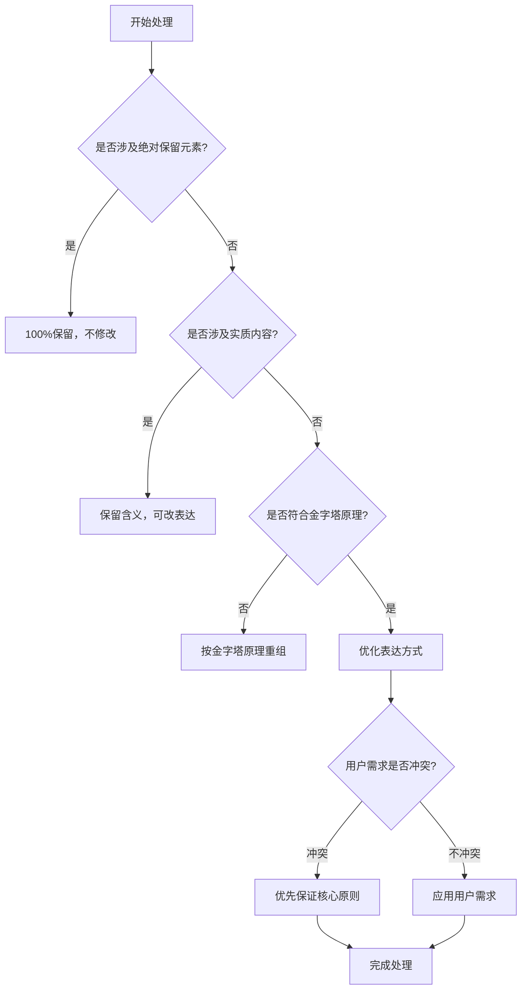
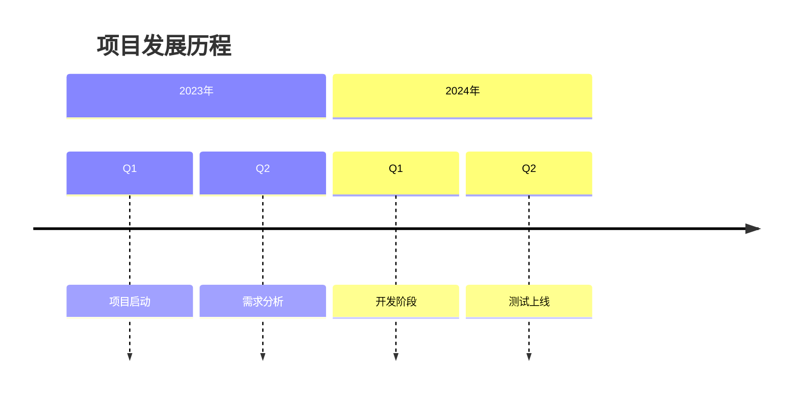
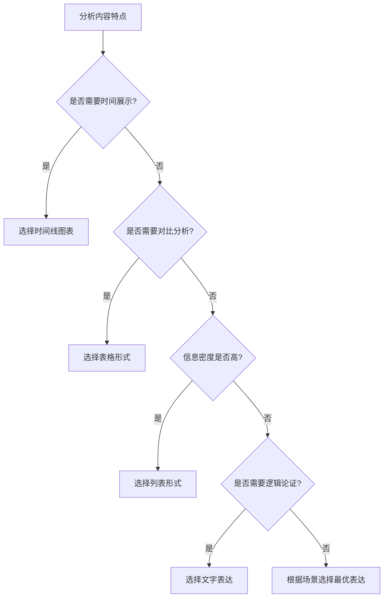
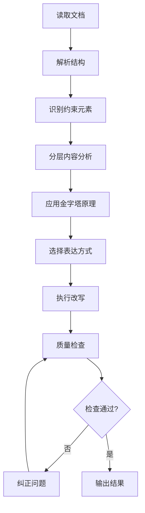

# Document Pyramid Rewrite Command

基于金字塔原理的智能文档重写工具，用于改写markdown文档的章节内容，**严格保持原文实质内容不增不减**，在遵守金字塔原理的前提下，以提升清晰度为主要目标，同时兼顾表达流畅度。

## 🚀 快速开始

### 基本用法

```markdown
/md-pyramid-rewrite "input_file_path" "requirements"
```

**最小示例：**
```markdown
/md-pyramid-rewrite "document.md" ""
```

### 核心特性
- ✅ **实质内容100%保留**：不增不减，确保信息准确性
- ✅ **金字塔原理应用**：结论先行，逻辑清晰
- ✅ **智能表达优化**：根据内容特点选择最适合的表达方式
- ✅ **多层保护机制**：代码、链接等元素完整保留
- ✅ **UTF-8纯文本输出**：直接输出到标准输出流

### 参数说明
- `input_file_path`: 输入的markdown文件路径
- `requirements`: 用户自定义的改写需求（可选，默认空字符串）

## 🎯 核心原则

### 三层保护机制

**第一层（绝对保护）**：100%完整保留
- 源代码块（```）和行内代码（`）
- 图片元素（Markdown和HTML格式）
- 超链接（包括所有属性）
- HTML标签和第三方组件

**第二层（实质内容保护）**：含义完整，表达可调
- 核心观点、关键论据、重要概念
- 功能特征、逻辑关系、数据信息
- **严格禁止**：添加新观点、新论据、新数据、新概念

**第三层（表达方式优化）**：提升清晰度，不改变实质
- 连接词选择和句式结构调整
- 结构化表达（列表、表格、图表）
- 语言表达优化和格式改进

### 优先级决策系统



**优先级顺序**：绝对保留元素 > 实质内容保留 > 金字塔原理 > 表达方式优化 > 论述结构保留 > 用户需求 > 语言精炼

### 金字塔原理应用

**核心要求**：结论先行，三层支撑
```
段落结构：
├── 加粗核心结论
├── 主要论据（2-4个）
└── 具体例证和数据支撑
```

**保留论述结构**：
- 逻辑推理：基于...可以推断出、因此、由此可见
- 因果分析：究其原因、这导致了...、根本原因是...
- 证据支撑：以...为例、数据显示...、根据...研究
- 对比分析：相比之下、前者...而后者...、正如...一样

## 📝 实用示例

### 基础改写示例

**改造前（原文）：**
> 我们的团队在过去的一个季度中进行了大量的市场调研工作。我们调查了1000名目标用户，分析了他们的使用习惯和偏好。根据调研结果，我们发现用户对于产品的易用性有很高的要求。有80%的用户表示希望界面更加简洁。这些数据表明我们需要重新考虑产品设计的方向。

**改造后（金字塔原理应用）：**
> **基于市场调研数据，我们需要重新调整产品设计方向以提升用户体验。**

- **用户调研覆盖全面**：我们对1000名目标用户进行了深入的调研，获得了充分的用户行为数据支撑
- **易用性需求突出**：调研数据显示80%的用户对产品易用性提出明确要求，希望界面更加简洁直观
- **设计方向需要调整**：基于用户偏好分析，当前的设计理念与用户期望存在显著差异

### 表达方式转换示例

#### 1. 文字表达 → 列表形式

**改造前：**
> 在项目管理中，我们需要注意以下几个方面的风险：技术风险包括技术选型不当、技术实现困难等问题；人员风险包括关键人员离职、团队协作不畅等情况；时间风险包括进度延期、里程碑无法达成等挑战；成本风险包括预算超支、资源投入不足等困难。

**改造后：**
> **项目管理需要系统性地识别和应对四大类风险。**

- **技术风险**：技术选型不当、技术实现困难等技术层面的问题
- **人员风险**：关键人员离职、团队协作不畅等人力资源相关的挑战
- **时间风险**：进度延期、里程碑无法达成等时间管理方面的问题
- **成本风险**：预算超支、资源投入不足等财务控制方面的困难

#### 2. 文字表达 → 表格形式

**改造前：**
> 我们比较了三种不同的技术方案。第一种方案性能最好，但是成本很高，实施周期也比较长。第二种方案性能中等，成本适中，实施周期也比较适中。第三种方案性能相对较差，但是成本最低，实施周期也最短。

**改造后：**
> **三种技术方案在性能、成本和实施周期方面存在显著差异，需要根据项目优先级进行选择。**

| 方案 | 性能表现 | 成本水平 | 实施周期 | 适用场景 |
|------|----------|----------|----------|----------|
| 方案一 | ⭐⭐⭐⭐⭐ | ⭐⭐ | ⭐⭐ | 高性能要求，预算充足 |
| 方案二 | ⭐⭐⭐ | ⭐⭐⭐ | ⭐⭐⭐ | 平衡型需求 |
| 方案三 | ⭐⭐ | ⭐⭐⭐⭐⭐ | ⭐⭐⭐⭐⭐ | 预算有限，周期紧张 |

#### 3. 文字表达 → 图表形式

**改造前：**
> 我们项目的发展经历了几个重要阶段。2023年第一季度我们启动了项目，第二季度进行了需求分析。2024年第一季度进入开发阶段，第二季度完成了测试和上线工作。

**改造后：**
> **项目按照既定时间规划顺利完成了从启动到上线的全流程。**



### 复杂概念重组示例

**改造前：**
> 在软件开发过程中，我们经常遇到各种各样的技术挑战。这些挑战可能来自于技术架构的选择、团队技能的匹配、项目进度的控制等多个维度。如果我们不能很好地处理这些问题，就可能导致项目延期、质量下降甚至失败。因此，我们需要建立一套系统的技术管理方法来应对这些挑战。

**改造后：**
> **系统性的技术管理方法对于应对软件开发中的多维挑战至关重要。**

- **技术挑战涉及多个维度**：
  - 技术架构选择：需要平衡技术先进性、成熟度和适用性
  - 团队技能匹配：确保技术要求与团队能力相符
  - 项目进度控制：在质量要求和时间限制间找到平衡点

- **管理不善的后果严重**：项目延期、质量下降、甚至项目失败

- **系统化管理方法的核心价值**：通过标准化的流程和工具，提前识别风险、制定应对策略、确保项目顺利推进

## 🎨 表达方式智能选择

### 表达方式选择决策树



### 四种表达方式的适用标准

#### 1. 文字表达 - 详细解释型

**适用场景：**
- ✅ 需要深入解释和论证的内容
- ✅ 建立逻辑推理和因果关系
- ✅ 反思教训和总结经验
- ✅ 复杂概念的系统阐述

**判断标准：**
- 是否需要建立完整的论证链条？
- 是否需要详细解释概念之间的关系？
- 是否需要进行深度的分析和推理？

#### 2. 列表形式 - 要点展示型

**适用场景：**
- ✅ 罗并列项的分类信息
- ✅ 需要快速浏览的重点内容
- ✅ 步骤说明和操作指南
- ✅ 并行观点的清晰呈现

**判断标准：**
- 各项之间是否具有并列关系？
- 用户是否需要快速获取关键信息？
- 内容是否适合分点阐述？

#### 3. 表格形式 - 对比分析型

**适用场景：**
- ✅ 多维度数据的系统比较
- ✅ 统计数据的可视化展示
- ✅ 对应关系的明确呈现
- ✅ 参数对比和特征分析

**判断标准：**
- 是否存在2个以上的对比维度？
- 是否需要系统化的数据整理？
- 是否要突出不同选项的差异？

#### 4. 图表形式 - 关系可视化型

**适用场景分类：**

| 图表类型 | 核心用途 | 适用内容特征 |
|----------|----------|--------------|
| **时间线** | 展示发展历程 | 按时间顺序的事件序列 |
| **甘特图** | 项目计划管理 | 任务依赖和时间安排 |
| **思维导图** | 层次关系分析 | 复杂概念的层次结构 |
| **流程图** | 流程关系展示 | 决策路径和处理流程 |

### 表达方式转换效果评估

**评估维度：**
1. **可读性提升度**：读者理解难度是否降低？
2. **信息传递效率**：信息获取速度是否提升？
3. **逻辑清晰度**：内容结构是否更加清晰？
4. **视觉效果**：整体呈现是否更吸引人？

**量化评估标准：**
- ⭐⭐⭐⭐⭐：显著提升，强烈推荐转换
- ⭐⭐⭐⭐：明显改善，建议转换
- ⭐⭐⭐：略有改善，可选转换
- ⭐⭐：改善有限，不建议转换
- ⭐：可能降低效果，避免转换

### 转换失败案例分析

**错误案例1：强行转换复杂论证为表格**
> **错误做法**：将完整的论证逻辑强行拆解为表格形式，导致论证链条断裂
> **正确处理**：保持文字表达，可将支撑数据单独制作表格

**错误案例2：过度使用图表形式**
> **错误做法**：为简单的并列关系制作复杂的思维导图
> **正确处理**：使用简单的列表形式即可达到效果

**错误案例3：混合表达方式使用不当**
> **错误做法**：在同一段落中混用多种表达方式，造成理解混乱
> **正确处理**：一个内容单元选择一种最适合的表达方式

## 🔍 质量控制清单

### 内容完整性检查

**第一层检查（绝对保护元素）：**
- [ ] 所有源代码块（```）完整保留
- [ ] 所有行内代码（`）完整保留
- [ ] 所有图片链接和属性完整保留
- [ ] 所有超链接和属性完整保留
- [ ] 所有HTML标签和第三方组件完整保留

**第二层检查（实质内容）：**
- [ ] 核心观点无丢失
- [ ] 关键论据完整保留
- [ ] 重要概念无遗漏
- [ ] 数据信息无改变
- [ ] 无新增任何实质内容

**第三层检查（表达优化）：**
- [ ] 改写程度充分（表达方式有显著变化）
- [ ] 语言表达更加清晰
- [ ] 逻辑结构更加合理
- [ ] 金字塔原理正确应用

### 金字塔原理符合度检查

**结构检查：**
- [ ] 每个段落以加粗结论开头
- [ ] 结论-论据-例证的三层结构清晰
- [ ] 论据之间具有逻辑层次关系
- [ ] 例证能够有效支撑论据

**逻辑检查：**
- [ ] 论证链条完整无断裂
- [ ] 因果关系明确合理
- [ ] 对比分析客观准确
- [ ] 逻辑推理严密有效

### 改写效果评估

**清晰度提升检查：**
- [ ] 信息传递效率明显提升
- [ ] 理解难度显著降低
- [ ] 重点信息突出明确
- [ ] 内容结构层次清晰

**用户需求满足检查：**
- [ ] 自定义需求得到适当满足
- [ ] 不与核心原则冲突
- [ ] 改写风格符合预期
- [ ] 目标读者群体适配

### 错误检测与纠正

**常见错误类型：**
1. **实质内容丢失**：未能完全保留原文重要信息
2. **新增实质内容**：添加了原文没有的观点或数据
3. **改写程度不足**：与原文基本一致，未达到改写要求
4. **违反金字塔原理**：结构混乱，结论不突出
5. **约束条件违反**：触碰了绝对保留元素

**纠正策略：**
- 重新识别并补充丢失的实质内容
- 删除所有新增的实质性信息
- 重点优化句式结构和表达方式
- 按金字塔原理重新组织内容结构
- 检查并修复对约束条件的违反

### 质量评分标准

| 评分维度 | 权重 | 评分标准（1-5分） |
|----------|------|------------------|
| 内容完整性 | 30% | 实质内容是否100%保留，无增减 |
| 结构合理性 | 25% | 金字塔原理应用是否正确 |
| 表达清晰度 | 20% | 改写是否提升信息传递效率 |
| 约束遵守度 | 15% | 绝对保留元素是否完整保护 |
| 需求满足度 | 10% | 用户需求是否合理满足 |

**总分计算**：各维度得分 × 权重之和
**及格标准**：总分 ≥ 4.0分，且内容完整性不得低于4.5分

## ⚙️ 技术约束与执行规范

### 约束条件分类说明

#### 🔒 硬约束（不可违反）
**约束原因**：确保技术信息准确性和系统完整性

| 约束类型 | 具体要求 | 违反后果 |
|----------|----------|----------|
| **代码保护** | 源代码块（```）和行内代码（`）100%保留 | 程序运行错误，技术信息丢失 |
| **媒体保护** | 所有图片链接和属性完整保留 | 视觉信息缺失，用户体验下降 |
| **链接保护** | 超链接和所有属性完整保留 | 导航功能失效，资源无法访问 |
| **HTML保护** | HTML标签和第三方组件完整保留 | 页面结构破坏，功能异常 |

#### 🔄 软约束（可适当调整）
**调整原则**：在不违反硬约束的前提下，可基于特殊情况申请调整

| 约束类型 | 基础要求 | 可调整情况 | 调整程序 |
|----------|----------|------------|----------|
| **实质内容** | 100%不增不减 | 表达方式需要重构 | 确保含义不变 |
| **金字塔原理** | 结论先行 | 文档类型特殊 | 保持结构清晰 |
| **用户需求** | 合理满足 | 与核心原则冲突 | 优先保证核心原则 |
| **语言精炼** | 提升清晰度 | 影响信息完整性 | 放弃精炼要求 |

### 约束宽松化条件

**申请条件**（必须同时满足）：
1. **技术必要性**：当前约束导致技术实现不可行
2. **用户明确要求**：用户明确提出调整需求并了解风险
3. **替代方案无效**：所有替代方案均无法解决问题
4. **风险评估完成**：已充分评估调整后的风险

**调整程序**：
```
用户申请 → 风险评估 → 替代方案验证 → 级别批准 → 执行调整 → 效果监控
```

### AI执行准则

#### 🎯 核心执行原则
1. **严格分层处理**：按三层保护机制逐层检查
2. **优先级决策**：遇到冲突时严格按照优先级顺序处理
3. **质量导向**：始终以提升清晰度为改写目标
4. **用户中心**：在满足约束前提下最大化满足用户需求

#### 🔧 操作化执行流程


#### ⚠️ 常见执行陷阱及避免策略

**陷阱1：过度改写**
- **表现**：改写后与原文意思不一致
- **避免**：建立"原意对照检查"机制

**陷阱2：改写不足**
- **表现**：改写后与原文基本相同
- **避免**：设定"表达方式变化度"阈值

**陷阱3：约束误判**
- **表现**：错误识别约束元素类型
- **避免**：使用元素识别规则和边界案例库

**陷阱4：优先级混乱**
- **表现**：用户需求覆盖核心原则
- **避免**：使用优先级决策树自动判断

### 输出规范

#### 📋 技术规格要求
- **编码格式**：UTF-8纯文本，确保中文字符正确显示
- **输出方式**：标准输出流，不直接写入文件
- **格式保持**：保留原始标题结构和层级关系
- **文件安全**：不修改原始输入文件

#### ✅ 输出质量要求
- **内容完整性**：所有实质内容100%保留
- **结构合理性**：符合金字塔原理要求
- **表达清晰度**：比原文更具可读性
- **约束遵守度**：所有硬约束100%遵守

## 🚀 高级用法与最佳实践

### 自定义需求应用指南

#### 语言风格调整
- **正式商务风格**：使用更规范的书面语，适当增加专业术语
- **简洁明了风格**：减少修饰性词汇，强化重点信息
- **技术文档风格**：标准化术语表达，增加技术细节的精确性

#### 读者群体适配
- **高管读者**：突出商业价值和决策支持信息
- **技术专家**：保持技术深度，强化逻辑严密性
- **普通用户**：简化专业术语，增强可理解性

### 典型应用场景

#### 1. 商业报告优化
**重点**：突出结论，强化数据支撑，提升决策参考价值
**策略**：
- 将分析结论前置并加粗
- 数据信息表格化处理
- 风险和机遇列表化呈现

#### 2. 技术文档重构
**重点**：保持技术准确性，提升组织逻辑性
**策略**：
- 技术概念分层说明
- 代码示例完整保留
- 操作步骤列表化呈现

#### 3. 学术论文改写
**重点**：保持学术严谨性，强化论证逻辑
**策略**：
- 研究结论突出显示
- 论据结构化组织
- 引用信息完整保留

### 故障排除指南

#### 🔧 常见问题解决

**问题1：改写效果不佳**
**症状**：改写后与原文差异很小，清晰度无明显提升
**解决方案**：
1. 检查是否过度保留原文表达方式
2. 尝试更激进的表达方式转换
3. 确保金字塔原理结构正确应用

**问题2：实质内容丢失**
**症状**：原文重要信息在改写后消失
**解决方案**：
1. 使用质量检查清单逐项核对
2. 建立原文对照机制
3. 重点检查数据、观点、例证是否完整

**问题3：约束条件违反**
**症状**：代码、链接等元素被意外修改
**解决方案**：
1. 重新识别绝对保护元素
2. 使用元素隔离技术处理
3. 加强约束检测机制

**问题4：金字塔原理应用不当**
**症状**：段落结构混乱，结论不突出
**解决方案**：
1. 确保每段以加粗结论开头
2. 检查论据-结论的逻辑关系
3. 优化段落间的衔接过渡

### 性能优化建议

#### 大型文档处理
- **分块处理**：将长文档拆分为逻辑单元分别处理
- **一致性检查**：确保分块处理后整体风格统一
- **质量监控**：每块处理后进行质量评分

#### 批量改写策略
- **模板化**：为常见文档类型建立改写模板
- **标准化**：制定统一的改写标准和检查清单
- **自动化**：识别重复性内容并应用标准处理

## 📚 使用示例集合

### 基础使用示例
```markdown
/md-pyramid-rewrite "document.md" ""
```

### 带自定义需求的使用
```markdown
/md-pyramid-rewrite "technical_report.md" "突出技术优势，使用更正式的商业语言，适合高管汇报"
```

### 针对特定场景的优化
```markdown
/md-pyramid-rewrite "user_manual.md" "简化技术术语，使非技术人员也能理解"
```

```markdown
/md-pyramid-rewrite "research_paper.md" "强调数据支撑，增强说服力，适合学术报告"
```

### 清晰度提升专项
```markdown
/md-pyramid-rewrite "complex_document.md" "使用表格和图表提升技术概念的表达清晰度"
```

## ❓ 常见问题解答

### Q: 如何处理包含大量代码的技术文档？
**A**: 所有代码块（```）和行内代码（`）都会100%完整保留，不受金字塔原理改写影响。系统会自动识别并保护这些元素。

### Q: 图片和链接在改写过程中会如何处理？
**A**: 所有Markdown和HTML格式的图片、超链接都会100%完整保留，包括所有属性。这是第一层保护机制的核心要求。

### Q: 如果用户需求与金字塔原理冲突怎么办？
**A**: 按照严格的优先级顺序处理：绝对保留元素 > 实质内容保留 > 金字塔原理 > 表达方式优化 > 论述结构保留 > 用户需求 > 语言精炼。核心原则优先于用户需求。

### Q: 改写程度如何判断是否充分？
**A**: 标准是"意思完全相同，表达更加清晰，结构更加合理"。如果改写后与原文基本一致，说明改写程度不足，需要进一步优化表达方式。

### Q: 可以添加解释说明来帮助读者理解吗？
**A**: **绝对不可以**。改写工具严禁添加原文中没有的任何解释说明或背景信息。所有内容必须100%源自原文。

### Q: 如何确保改写质量？
**A**: 使用内置的质量控制清单和评分标准，从内容完整性、结构合理性、表达清晰度、约束遵守度、需求满足度五个维度进行全面评估。

---

## 🎯 核心价值总结

**Document Pyramid Rewrite Command** 通过严格的分层保护机制、科学的优先级系统和智能的表达方式选择，在确保内容100%准确的前提下，实现文档表达效果的最大化提升。

**核心优势**：
- ✅ **零风险**：绝对保护技术元素，确保功能完整性
- ✅ **高质量**：科学的质量控制体系，确保改写效果
- ✅ **智能化**：自动选择最优表达方式，提升信息传递效率
- ✅ **灵活性**：支持多种场景需求，适应不同文档类型
- ✅ **标准化**：统一的执行流程，确保结果一致性

