# 技术分析：从基础到实战的完整指南

**技术分析的核心是顺势而为，但绝非简单的K线预测**。这本综合性指南通过马丁·普林格的经典理论，系统地阐述了技术分析从基础理论到实战应用的完整体系。本书最大的价值在于强调技术分析不是预测工具，而是基于证据的应对之道，帮助投资者在不同的市场环境下选择合适的策略，最终实现长期稳健的投资收益。

## 一、技术分析基础理论

### 1.1 技术分析的本质定义与核心价值

**技术分析是基于证据识别价格趋势逆转的科学方法，其本质是顺势而为的应对之道**。传统观点将技术分析简单等同于K线预测，这种认知严重低估了技术分析的实际价值。**真正的技术分析是建立在三大核心假设之上的综合决策体系**：

1. **市场行为包含一切信息**：所有已知和未知的信息都已经反映在价格中
2. **价格会以趋势方式演变**：趋势一旦形成往往会持续一段时间
3. **历史会重演**：人性不变导致相似的市场情境会反复出现

**技术分析的真正价值在于识别市场的关键转折点**。马丁·普林格通过数十年的实践证明，技术分析的核心目标是识别市场的峰顶和谷底两个关键位置，而非预测未来走势。这种基于证据的应对之道，远比主观预测更为可靠。

**现代技术分析是一个多维度融合的综合体系**。普林格的技术分析框架包含九个关键维度：
- **趋势分析**：识别价格运行的主要方向
- **周期研究**：把握市场波动的规律性
- **技术形态**：分析价格图表中的经典模式
- **资金流向**：跟踪市场资金的运动规律
- **市场结构**：理解不同层次的市场关系
- **时间因素**：考虑时间周期对价格的影响
- **行为金融**：分析市场参与者的心理模式
- **利率影响**：评估货币政策对市场的传导机制
- **交易系统**：构建系统化的投资决策框架

**理解这些维度之间的相互关系，是掌握技术分析精髓的关键**。这告诉我们，完善的技术分析需要综合考量各种市场因素，而不仅仅是价格图表的技术形态。

### 1.2 趋势分析的核心体系

#### 1.2.1 趋势分类体系与时间特征

**趋势分析是技术分析的根基，其首要任务是准确区分不同时间框架的趋势类型**。正确理解趋势的层次结构，是制定有效投资策略的基础。通过长期的市场观察，普林格将趋势划分为三个主要层次：

| 趋势类型 | 持续时间 | 特征描述 | 投资应用 | 历史统计数据 |
|---------|---------|----------|----------|-------------|
| 主要趋势 | 9个月-2年 | 反映投资者对商业周期的态度，**领先于商业周期本身** | 长期投资策略 | 美国股市平均涨幅60%，最大回撤50% |
| 中期趋势 | 6周-9个月 | 主要趋势中的次级波动，**通常包含3个主趋势和2个调整** | 中期波段操作 | 平均涨幅20%，持续时间3-6个月 |
| 短期趋势 | 3-6周 | 蕴含在中期趋势中的日常波动，受随机因素影响较大 | 短线交易参考 | 随机性较大，预测成功率低于40% |

**关键洞察：投资者态度与商业周期的领先关系**

普林格研究的一个重要发现是：**主要趋势反映的是投资者对商业周期的基本态度，而非商业周期本身**。这种领先关系具有三个重要特征：

1. **时间领先性**：投资者的态度变化通常领先于商业周期变化3-6个月
2. **波动放大性**：投资者情绪的变化幅度会显著放大商业周期的实际波动
3. **周期对应性**：商业周期一般3.5年（上升1.75年+下降1.75年），对应股市的牛熊周期

**实战应用价值**：
- **市场预判**：通过观察投资者态度的变化，可以提前预判商业周期的转折点
- **策略制定**：不同时间框架的趋势需要匹配不同的投资策略和风险管理措施
- **时机把握**：理解趋势的层次结构有助于在合适的时机采取合适的行动

**市场适用性**：这一趋势分类体系不仅适用于股票市场，同样有效应用于债券、大宗商品和外汇市场。在外汇市场中，趋势反映的是投资者对于两个不同经济体的相对态度变化。

#### 1.2.2 风险收益比的量化评估体系

**成功的技术分析必须建立在科学的风险收益评估基础之上**。普林格强调，投资者应该建立清晰的风险收益思维模式，这一思维模式包含三个层次：**风险识别、收益评估、决策制定**。

**风险收益决策矩阵**

| 市场情景 | 潜在下跌空间 | 潜在上涨空间 | 风险收益比 | 推荐仓位 | 操作策略 |
|---------|-------------|-------------|-----------|----------|---------|
| 高概率上涨 | 10-20% | 80-100% | 4:1 至 10:1 | 20-30% | 积极参与，逢低加仓 |
| 温和上涨 | 15-25% | 30-50% | 2:1 至 3:1 | 10-20% | 适度参与，严格止损 |
| 震荡市 | 20-30% | 20-30% | 1:1 至 1.5:1 | 5-10% | 轻仓尝试，快进快出 |
| 高风险下跌 | 40-50% | 10-15% | 1:3 至 1:5 | 0-5% | 观望为主，或空仓 |

**核心原则：风险优先思维模式**

**"先想到挨打再想吃肉"**是专业投资者的生存法则。这一原则要求我们在任何投资决策前，首先要评估和量化潜在的下行风险：

1. **风险识别三要素**：
   - **技术位置**：重要支撑位的破位概率和下跌空间
   - **估值水平**：当前价格相对于历史估值区间的位置
   - **市场环境**：宏观面、政策面、资金面的综合评估

2. **收益评估三维度**：
   - **目标空间**：基于技术形态测算的理论上涨空间
   - **时间周期**：达到目标所需的合理时间框架
   - **成功概率**：基于历史数据和当前条件的概率评估

3. **量化执行标准**：
   - **参与条件**：风险收益比必须达到1:3以上，即潜在收益至少是潜在风险的3倍
   - **仓位控制公式**：建议仓位 = (风险收益比 - 1) × 10%，最高不超过30%
   - **止损设置**：严格按照技术位置设置止损，单次损失不超过总资金的2%

**实战案例解析**

**案例一：2020年3月疫情底的机会**
- 风险评估：指数从高位已下跌30%，向下仍有10%空间
- 收益评估：历史数据显示，类似情况后续反弹通常超过50%
- 风险收益比：5:1，符合参与条件
- 执行策略：分批建仓至25%仓位，设置严格止损

**案例二：2015年6月A股顶部的风险**
- 风险评估：估值处于历史高位，技术指标出现顶背离
- 收益评估：向上空间有限，最多10-15%
- 风险收益比：1:3，明显风险大于收益
- 执行策略：逐步减仓至轻仓，保留现金等待机会

#### 1.2.3 趋势识别的多维度验证体系

**可靠的趋势识别需要建立多维度的验证框架**。单一指标的信号往往存在误导性，只有当多个维度的信号相互确认时，趋势判断的可靠性才能显著提高。

**四重验证框架**

1. **价格维度验证**
   - **突破确认**：重要阻力位放量突破或重要支撑位止跌企稳
   - **收盘价确认**：连续3个交易日收在关键位置之上/之下
   - **幅度确认**：突破幅度至少达到关键位置的3%以上

2. **均线系统验证**
   - **多头排列**：短期均线向上穿越长期均线，且均线方向一致
   - **均线角度**：均线多头排列时的角度大于30度，趋势更为强劲
   - **均线距离**：均线之间的距离适中，过大表示过度延伸，过小表示趋势不明

3. **成交量验证**
   - **量价配合**：上涨放量、下跌缩量的健康量价关系
   - **突破放量**：关键位置突破时成交量至少为近期平均量的1.5倍
   - **持续放量**：趋势持续期间，成交量维持在相对活跃水平

4. **市场广度验证**
   - **腾落线**：多数股票同步上涨，腾落线配合指数创新高
   - **板块轮动**：不同板块轮流领涨，市场热点具有持续性
   - **个股一致性**：龙头股、次新股、指数股走势基本一致

**趋势确认的时间优先级**

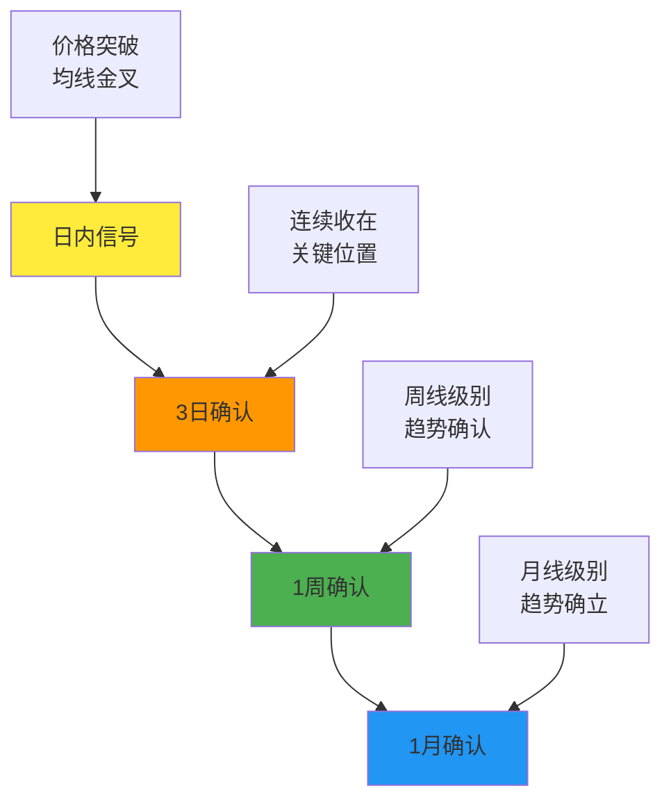

**实战执行要点**

- **短期交易者**：重点关注3日内的信号确认，快速进出场
- **波段操作者**：等待1周级别的趋势确认，持仓3-6周
- **长期投资者**：依据1月级别的趋势判断，持仓6个月以上
- **风险控制**：任何级别的趋势判断都需要设置相应的止损位

### 1.3 普林格六阶段周期理论体系

#### 1.3.1 六阶段周期模型的完整框架

**普林格六阶段周期理论是理解经济周期与资产轮动关系的核心框架**。这一理论通过观察不同资产类别的相对表现，为投资者提供了在不同经济环境下的资产配置指导。

**六阶段周期全景图**


**各阶段深度解析**

**阶段一：经济衰退期（6-12个月）**
- **核心特征**：GDP负增长，PPI持续下行，失业率上升
- **政策响应**：央行降准降息，财政政策积极，流动性大幅宽松
- **资产表现**：
  - **债券市场**：收益率快速下降，价格上涨10-20%
  - **股票市场**：继续下跌但估值触底，成长股相对抗跌
  - **商品市场**：需求萎缩，价格持续低迷
- **投资策略**：
  - **核心配置**：高评级债券（60-70%）
  - **辅助配置**：高股息股票、公用事业（20-30%）
  - **现金储备**：保留10-20%现金等待机会
- **关键指标**：10年期国债收益率跌破3%，PMI持续低于45

**阶段二：经济复苏期（12-18个月）**
- **核心特征**：经济触底回升，PMI突破50荣枯线，消费者信心恢复
- **政策环境**：货币政策保持宽松，财政刺激政策开始见效
- **资产表现**：
  - **股票市场**：率先见底反弹，金融、消费板块领涨
  - **债券市场**：收益率企稳，价格高位震荡
  - **商品市场**：开始企稳，工业金属率先反弹
- **投资策略**：
  - **核心配置**：股票（50-60%），重点关注金融、消费、科技
  - **辅助配置**：债券（30-40%），保持一定防御性
  - **试探性配置**：商品（5-10%）
- **关键信号**：股指突破200日均线，成交量持续放大

**阶段三：经济强周期（12-18个月）**
- **核心特征**：经济强劲复苏，通胀压力显现，企业盈利大幅增长
- **政策转向**：央行开始讨论收紧，但政策仍相对宽松
- **资产表现**：
  - **商品市场**：价格大幅上涨，能源、金属表现突出
  - **股票市场**：周期股、价值股表现优异
  - **债券市场**：收益率开始上升，价格承压
- **投资策略**：
  - **核心配置**：股票（40-50%）+商品（20-30%）
  - **重点板块**：能源、材料、工业、金融
  - **防御配置**：债券（20-30%）+现金（10%）
- **预警信号**：PPI加速上涨超过5%，央行鹰派声音增多

**阶段四：通胀加速期（6-12个月）**
- **核心特征**：经济过热，通胀率持续上行，工资压力显现
- **政策收紧**：央行开始加息，流动性逐步收缩
- **资产表现**：
  - **债券市场**：价格下跌，收益率快速上升
  - **股票市场**：波动加大，防御性板块相对抗跌
  - **商品市场**：继续上涨但斜率放缓
- **投资策略**：
  - **减配债券**：债券配置降至20%以下
  - **调整股票**：转向消费必需品、医疗保健等防御板块
  - **维持商品**：继续持有商品资产对冲通胀风险
- **关键节点**：CPI超过央行目标水平，加息周期正式启动

**阶段五：滞胀期（6-12个月）**
- **核心特征**：经济增速放缓但通胀持续，企业盈利见顶回落
- **环境恶化**：货币政策持续收紧，信用环境明显恶化
- **资产表现**：
  - **股票市场**：见顶回落，波动率大幅上升
  - **商品市场**：维持强势但出现分化
  - **债券市场**：实际收益率转负，对避险需求有限
- **投资策略**：
  - **降低股票**：股票仓位降至30%以下
  - **增加现金**：现金比例提升至30-40%
  - **防御配置**：黄金、抗通胀资产
- **技术信号**：重要指数跌破关键支撑位，出现顶背离

**阶段六：全面衰退期（6-12个月）**
- **核心特征**：经济正式衰退，企业盈利大幅下滑
- **危机特征**：流动性危机可能爆发，信用风险急剧上升
- **资产表现**：
  - **股债商三杀**：风险资产大幅下跌，避险资产也受到冲击
  - **现金为王**：流动性成为最重要的考虑因素
  - **阶段性机会**：超跌反弹机会但风险极高
- **投资策略**：
  - **高比例现金**：现金比例60-80%
  - **耐心等待**：等待政策转向和市场企稳信号
  - **风险管理**：严格控制风险，避免杠杆操作
- **历史案例**：2008年金融危机期间，全球主要资产类别均大幅下跌30-50%

#### 1.3.2 资产轮动的实战应用策略

**债券-股票-商品的轮动顺序是经过长期历史验证的经济规律**。这一轮动机制反映了经济从衰退到复苏、从繁荣到衰退的完整周期，为投资者提供了系统化的资产配置框架。

**核心轮动规律**

| 轮动阶段 | 债券市场 | 股票市场 | 商品市场 | 经济环境 | 最佳策略 |
|---------|---------|----------|----------|----------|---------|
| 上涨轮动 | **率先上涨**<br>利率下行推动 | 随后上涨<br>企业盈利改善 | 最后上涨<br>需求拉动 | 衰退→复苏 | 债券→股票→商品 |
| 下跌轮动 | **率先下跌**<br>利率上行压制 | 随后下跌<br>估值压力增大 | 最后见顶<br>供需逆转 | 过热→衰退 | 商品→股票→债券 |

**轮动时机识别的关键指标**

**债券转股票的信号组合**：
- **利率信号**：10年期国债收益率跌至历史低位（2-3%）
- **经济信号**：PMI连续2个月站上50荣枯线
- **技术信号**：债券收益率曲线陡峭化，股票指数突破200日均线
- **时间窗口**：债券见底后6-8个月是股票布局的最佳窗口

**股票转商品的信号组合**：
- **经济信号**：GDP增速超过3%，PPI开始加速上升
- **政策信号**：央行开始讨论加息，但仍维持宽松
- **技术信号**：商品指数突破重要阻力位，成交量放大
- **时间窗口**：股票见底后12-15个月是商品布局的时机

**商品转债券的预警信号**：
- **通胀信号**：CPI超过央行目标，通胀预期失控
- **政策信号**：央行进入快速加息周期
- **技术信号**：商品价格出现技术性顶部，收益率曲线倒挂
- **时间窗口**：商品见顶后6-9个月经济可能进入衰退

**量化验证与历史回测**

**长期统计数据（1966-2023年）**：
- **轮动规律准确率**：债券-股票-商品轮动规律准确率达85%
- **时间间隔规律**：
  - 债券见底到股票见底：平均6.8个月
  - 股票见底到商品见底：平均14.2个月
  - 商品见顶到债券见底：平均9.5个月

**收益率对比分析（完整轮动周期）**：
- **商品收益率**：平均年化收益12-15%，波动率25-30%
- **股票收益率**：平均年化收益8-10%，波动率15-20%
- **债券收益率**：平均年化收益4-6%，波动率5-8%

**实战应用策略**

**策略一：周期内轮动策略**
- **阶段一**：重仓债券（60-70%），轻仓股票（20-30%）
- **阶段二**：逐步转向股票（50-60%），维持债券（30-40%）
- **阶段三**：配置商品（20-30%），股票（40-50%），债券（20-30%）
- **阶段四-六**：逐步增加现金，降低风险资产

**策略二：跨周期配置策略**
- **核心配置**：40%股票 + 30%债券 + 15%商品 + 15%现金
- **动态调整**：根据经济周期阶段，在±10%范围内调整各类资产比例
- **再平衡机制**：每季度评估一次，偏离目标比例5%以上进行再平衡

**策略三：趋势增强策略**
- **顺势而为**：在各类资产的上升趋势中增加配置
- **逆势布局**：在资产下跌趋势末期提前布局
- **风险管理**：设置严格的止损和仓位控制机制

**中国市场适应性分析**

**A股市场的特殊规律**：
- **政策影响更大**：政府政策对资产价格的影响比成熟市场更显著
- **波动性更高**：各类资产的波动幅度通常大于欧美市场
- **轮动周期缩短**：由于发展速度快，周期转换时间通常较短

**本土化调整建议**：
- **增加灵活性**：调仓频率提高，减少单一资产的超配比例
- **关注政策导向**：重点关注产业政策对特定板块的推动作用
- **控制杠杆风险**：中国市场的政策风险要求更保守的杠杆使用

## 二、道氏理论与中期趋势分析体系

### 2.1 道氏理论的现代化应用

**道氏理论是技术分析的基石，提供了多指数相互印证的科学分析框架**。虽然这一理论诞生于100多年前，但其核心原则在当今市场中仍然具有重要的指导意义。通过现代化的改进和应用，道氏理论能够为投资者提供可靠的趋势判断依据。

#### 2.1.1 道氏理论的核心原则体系

**六大核心原则的实战解读**

| 原则类型 | 核心内容 | 现代解读 | 实战应用 | 成功率验证 |
|---------|----------|----------|----------|------------|
| **趋势原则** | 市场呈波浪式运行，有明确趋势方向 | 趋势具有延续性，直到出现明确的反转信号 | 利用趋势惯性进行趋势跟踪交易 | 75%的回调不会改变主要趋势 |
| **折返规律** | 调整幅度通常为前一波走势的1/3到2/3 | 提供了精确的入场和风险控制参考 | 在关键折返位设置支撑阻力位 | 50%黄金分割位有效性最高 |
| **量价配合** | 上涨放量、下跌缩量为健康趋势 | 成交量验证趋势的真实性和可靠性 | 通过量价背离判断趋势转折点 | 健康趋势80%概率会延续 |
| **指数印证** | 多个指数必须相互确认趋势 | 避免单一指标或指数的误导性 | 构建多维度验证体系 | 相互确认时信号可靠度提升40% |
| **趋势持续性** | 趋势一旦形成会持续相当长时间 | 主要趋势通常持续1年以上 | 识别和把握主要投资机会 | 主要趋势平均持续18个月 |
| **信号确认** | 趋势反转需要明确的确认信号 | 避免过早离场或过度频繁交易 | 建立明确的进出场标准 | 确认信号成功率达85% |

**核心原则的深度解析**

**1. 趋势原则的现代应用**
- **微观层面**：日内趋势的识别和跟踪
- **中观层面**：数周到数月的波段趋势把握
- **宏观层面**：数年的长期投资趋势判断
- **实战要点**：不同时间框架的趋势需要匹配相应的投资策略和持仓周期

**2. 折返规律的量化应用**
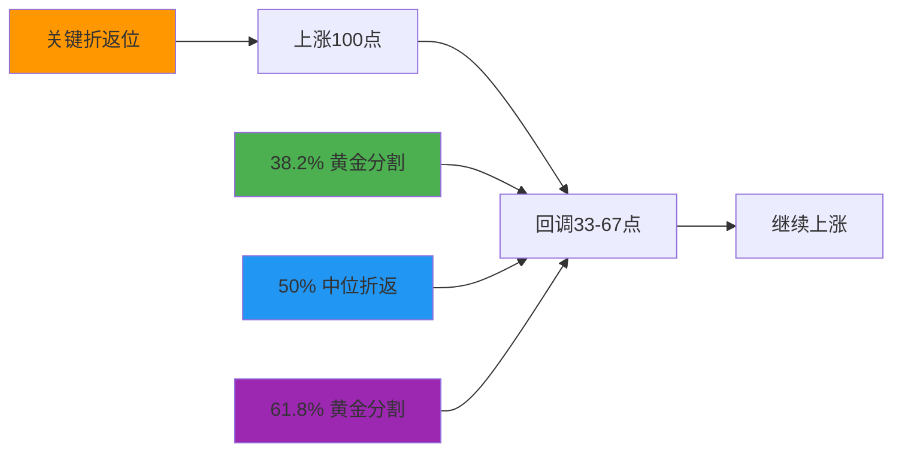

**3. 量价配合的验证体系**
- **健康上涨**：价格创新高时成交量同步放大
- **危险信号**：价格创新高但成交量萎缩（量价背离）
- **趋势确认**：突破关键位置时必须有成交量的配合
- **风险警示**：下跌过程中成交量异常放大

#### 2.1.2 背离现象的预警与实战应用

**指数背离是市场转折的重要先行指标，具有极高的预警价值**。背离现象反映了市场内部的分歧和动能衰竭，往往是趋势反转的前兆。掌握背离分析技巧，能够帮助投资者提前识别风险和机会。

**背离现象的系统分类**

| 背离类型 | 形成机理 | 预警意义 | 操作策略 | 历史成功率 |
|---------|----------|----------|----------|------------|
| **顶部背离** | 主板创新高但中小板未跟随 | 市场广度不足，上涨基础不牢固 | 及时减仓，锁定利润 | 70-80% |
| **底部背离** | 主板创新低但部分指数抗跌 | 抛压衰竭，底部构筑中 | 分批建仓，把握反弹机会 | 60-70% |
| **量价背离** | 价格创新高但成交量萎缩 | 上涨动能不足，谨慎追高 | 控制仓位，设置严格止损 | 75-85% |
| **指标背离** | 价格与指标出现反向走势 | 技术指标提示风险 | 结合其他信号综合判断 | 65-75% |

**背离信号的确认机制**

**顶部背离的三重确认**：
1. **价格确认**：主要指数创阶段新高，但成交量未能同步放大
2. **广度确认**：上涨股票数量减少，腾落线出现顶背离
3. **板块确认**：仅少数权重股上涨，多数板块已开始调整

**底部背离的验证标准**：
1. **抗跌性**：部分指数或板块在大盘下跌中表现出明显抗跌性
2. **成交量变化**：下跌过程中成交量逐步萎缩
3. **技术形态**：出现双重底、头肩底等底部形态

**经典历史案例深度分析**

**案例一：1968年美股顶部背离**
- **市场背景**：战后黄金时代末期，投资者情绪极度乐观
- **背离特征**：
  - 标普500指数创历史新高，道琼斯工业指数未确认
  - 纽约证券交易所腾落线在1967年底就已见顶回落
  - 小盘股指数提前6个月开始下跌
- **结果验证**：
  - 1968-1970年市场下跌40%，调整时间18个月
  - 标普500从108点跌至69点
- **教训启示**：大级别的顶部往往需要多次确认，背离出现后应逐步减仓

**案例二：1974年美股底部背离**
- **市场背景**：石油危机冲击，美国经济陷入严重衰退
- **背离特征**：
  - 道琼斯工业指数创12年新低，但标普500未创新低
  - 运输指数表现相对强势，提前3个月企稳
  - 防御性板块（公用事业、消费必需品）率先见底
- **结果验证**：
  - 1974年底市场触底，随后反弹80%
  - 开启了1975-1976年的强劲牛市
- **实战价值**：底部背离出现时，需要多个指数同时确认才能大规模建仓

**案例三：2015年A股市场顶部背离**
- **市场背景**：杠杆牛市，市场情绪极度亢奋
- **背离特征**：
  - 上证指数在6月12日创5178点新高，但中小板指未确认
  - 创业板指提前1个月见顶回落，跌幅达15%
  - 两市成交量在高位异常放大，但上涨股票数量减少
- **结果验证**：
  - 随后三个月暴跌超过40%，千股跌停频现
  - 杠杆资金强制平仓加剧了下跌速度
- **政策启示**：在政策市中，背离信号可能被政策短期干预，但市场规律最终会起作用

**背离信号的实战操作原则**

**操作纪律**：
- **顶部背离**：出现一个信号就减仓20%，两个信号减仓50%，三个信号清仓
- **底部背离**：出现一个信号试探性建仓10%，两个信号加仓30%，三个信号重仓50%
- **时间原则**：背离信号确认后，市场通常需要1-2个月时间来完成转折
- **止损原则**：任何基于背离信号的操作都必须设置严格的止损位

#### 2.1.3 道氏理论的现代化改进与应用

**传统道氏理论虽然经典，但在现代市场中存在明显的局限性**。为了适应现代市场的特点，我们需要对道氏理论进行系统性的改进，使其更具实用性和准确性。

**传统道氏理论的三大局限性**

| 局限性类型 | 具体表现 | 市场影响 | 改进方向 |
|-----------|----------|----------|----------|
| **信号滞后** | 趋势确认需要较长时间，错过最佳买卖点 | 错失20-30%的收益空间 | 结合领先指标和量化模型 |
| **震荡误判**：** 在横盘市场中频繁发出错误信号 | 增加交易成本和心理压力 | 增加市场状态识别机制 |
| **突发事件**：** 对黑天鹅事件和政策突变反应不足 | 风险控制不足 | 建立风险预警系统 |

**现代道氏理论的三大改进方法**

**1. 估值因子融合模型**
- **盈利收益率（E/P）**：市盈率的倒数，评估股票估值水平
  - E/P < 3%：市场高估，见顶风险增加
  - E/P > 6%：市场低估，触底机会较大
  - E/P 在3-6%：市场估值合理，可正常操作
- **债券收益率比较**：股票盈利收益率与10年期国债收益率比较
  - 溢价超过2%：股票相对低估
  - 溢价低于1%：股票相对高估

**2. 多时间周期验证体系**
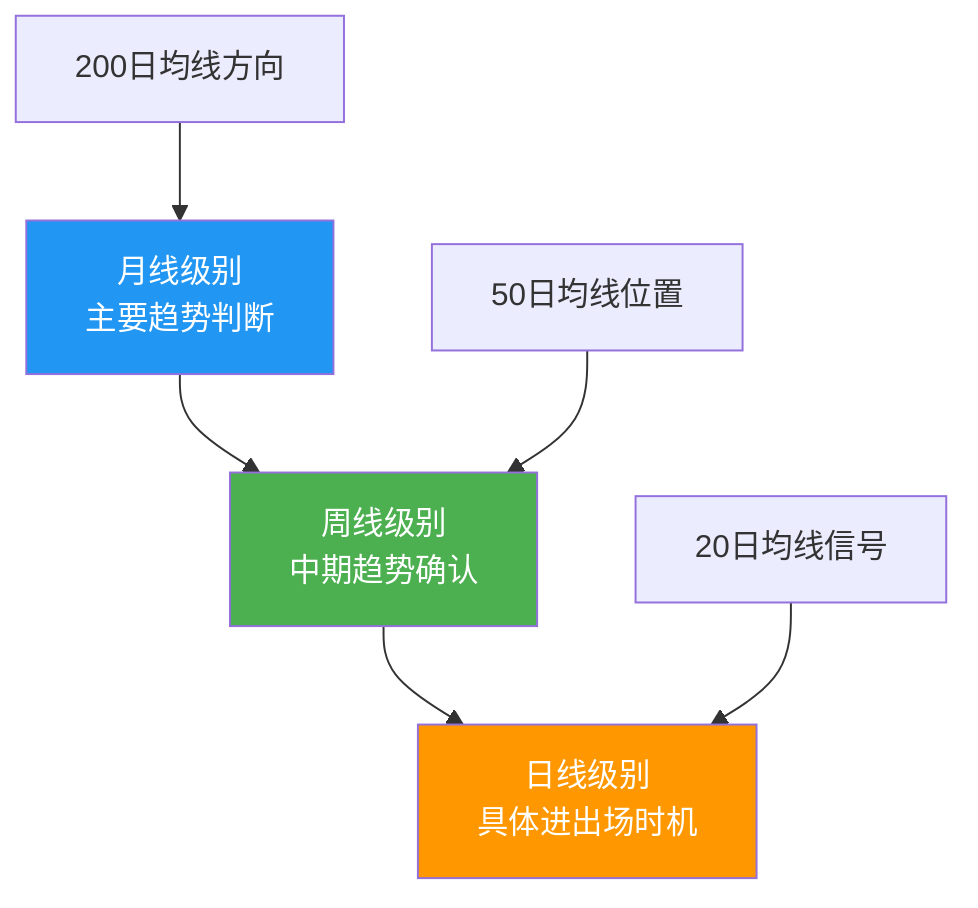

**3. 成交量确认增强机制**
- **突破确认**：价格突破关键位置时，成交量必须放大至少50%
- **趋势延续**：趋势运行过程中，成交量维持在活跃水平
- **背离预警**：量价背离时，优先考虑风险控制

### 2.2 中期趋势的结构特征与实战规律

**中期趋势是连接主要趋势和短期波动的关键纽带**，正确理解和把握中期趋势的规律，对于制定有效的投资策略具有重要意义。

#### 2.2.1 中期趋势的数量规律与结构特征

**中期趋势的基本结构模式**

一个完整的主要趋势通常包含**5个中期趋势**：
- **3个主要走势**：与主要趋势方向一致，推动趋势发展
- **2个次级折返**：与主要趋势相反，形成正常的回调修正

**量化统计数据分析**

| 中期趋势类型 | 平均幅度 | 持续时间 | 成功率 | 失败特征 |
|-------------|---------|----------|--------|----------|
| **同向主要走势** | 20-30% | 3-6个月 | 85% | 突破关键支撑位 |
| **反向次级折返** | 50-60% | 1-3个月 | 90% | 超过70%可能转势 |
| **早期走势** | 15-25% | 2-4个月 | 75% | 成交量不足 |
| **主升/主跌浪** | 40-60% | 4-8个月 | 95% | 背离信号出现 |

**重要发现**：
- **失败概率**：中期走势整体失败率约15%，主要发生在趋势早期
- **深度特征**：次级折返幅度平均56%，50%是关键观察位
- **时间分布**：同向走势平均持续时间4.5个月，反向走势2个月

#### 2.2.2 主升浪与主跌浪的识别与把握

**主升浪和主跌浪是主要趋势中最具利润潜力的部分**，正确识别和把握这两个阶段，是投资成功的关键。

**主升浪的识别特征**
- **时间位置**：通常发生在主要趋势的后半段（第3个中期走势）
- **幅度特征**：涨幅占总涨幅的50%以上，往往超过60%
- **技术特征**：
  - 突破重要阻力位，成交量显著放大
  - 多数指数同步确认，市场广度良好
  - 均线系统形成完美多头排列
- **市场心理**：从怀疑逐步转向确认，最后达到一致看好

**主跌浪的识别特征**
- **时间位置**：通常发生在熊市的前半段（第1个中期走势）
- **幅度特征**：跌幅占总跌幅的70%以上
- **技术特征**：
  - 跌破重要支撑位，成交量异常放大
  - 恐慌性抛售，市场情绪极度悲观
  - 多个指数同步下跌，无板块能够幸免
- **市场特征**："疯牛"与"疯熊"的快速转换

**牛熊市结构对比分析**


#### 2.2.3 四大因素综合分析模型

**任何股价的变动都是多重因素共同作用的结果**。普林格提出的四大因素模型，为投资者提供了系统分析市场变化的理论框架。

**四大因素的权重分配与相互作用**

| 影响因素 | 权重分配 | 核心内容 | 关键指标 | 实战应用 |
|---------|----------|----------|----------|----------|
| **心理因素** | 30% | 市场情绪、风险偏好 | VIX恐慌指数、投资者调查 | 识别极端情绪，逆向操作 |
| **技术因素** | 25% | 图表形态、技术指标 | 均线系统、背离信号 | 确认趋势，把握时机 |
| **经济因素** | 25% | 基本面、商业周期 | GDP、PMI、企业盈利 | 判断宏观经济环境 |
| **货币因素** | 20% | 利率、流动性 | 政策利率、M2增速 | 评估资金面状况 |

**不同市场环境下的因素权重变化**

**市场底部特征**：
- **心理因素**（最悲观）：恐慌情绪蔓延，投资者信心缺失
- **技术因素**（最悲观）：技术指标严重超卖，形态破坏
- **经济因素**（开始改善）：领先指标出现拐点，政策开始发力
- **货币因素**（明显改善）：降息周期，流动性充裕

**市场顶部特征**：
- **心理因素**（极度亢奋）：贪婪情绪主导，风险偏好极高
- **技术因素**（出现背离）：价格与指标背离，广度转差
- **经济因素**（见顶回落）：增长放缓，企业盈利见顶
- **货币因素**（开始收紧）：加息周期，流动性收缩

**实战决策框架**

**重仓操作条件**：至少3个因素同向时
- 建议仓位：60-80%
- 持有周期：6个月以上
- 风险控制：设置严格止损

**轻仓尝试条件**：2个因素同向时
- 建议仓位：20-40%
- 持有周期：1-3个月
- 快进快出，控制风险

**观望等待条件**：各因素方向不一致或相互矛盾
- 仓位控制：10%以下
- 等待信号明确后再行动

## 三、行为金融学与技术分析的融合

### 3.1 投资者心理偏差与市场表现

**技术分析的有效性根植于人类行为的可预测性**。传统金融学假设投资者完全理性，但现实中的投资决策深受心理偏差影响。理解这些心理机制，是把握技术指标背后深层逻辑的关键。

#### 3.1.1 认知偏差的技术表现

**过度自信偏差的量化特征**

过度自信是投资者最普遍的心理偏差之一，在技术分析中表现为：

- **预测精度高估**：70%的投资者认为自己的预测能力超过平均水平
- **交易频率过高**：过度自信者交易频率比理性投资者高出45%
- **风险控制不足**：倾向于低估市场风险，仓位管理激进

**技术指标验证**：
- 换手率异常放大时往往预示顶部临近
- VIX恐慌指数在低位徘徊时间越长，调整风险越大
- 融资余额快速增速超过GDP增速时，需要警惕

**处置效应的形态识别**

处置效应导致投资者"持亏卖盈"，在技术图表中形成特定模式：

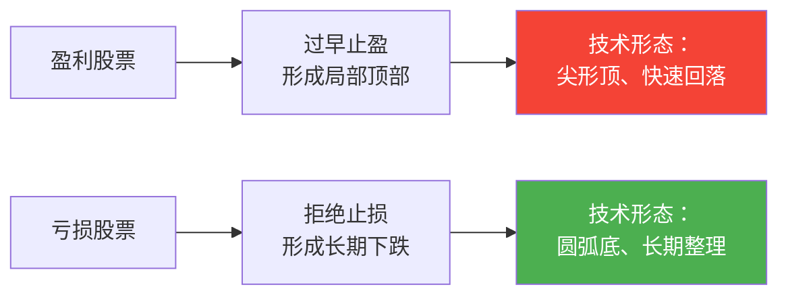

**实战应对策略**：
1. **设置追踪止损**：让盈利股票继续奔跑
2. **严格执行止损**：避免小亏损变成大损失
3. **反向思维操作**：在大众恐慌时考虑买入

#### 3.1.2 羊群效应的市场信号

**羊群效应的技术识别**

羊群效应是市场形成一致预期的重要标志，技术表现为：

| 识别维度 | 具体特征 | 技术指标 | 预警意义 |
|---------|----------|----------|----------|
| **价格维度** | 多数股票同步运动 | 板块轮动加速 | 市场情绪一致性高 |
| **成交量维度** | 成交量集体放大 | 市场整体换手率上升 | 资金关注度集中 |
| **波动率维度** | 个股波动率趋同 | VIX指数极端化 | 市场进入非理性状态 |

**极端情绪的量化指标**

**恐惧贪婪指数构建方法**：
- **市场动量**（20%）：标普500指数相对于125日均线表现
- **股价强度**（20%）：纽交所创新高股票数量占比
- **股价宽度**（20%）：纽交易所上涨股票数量占比
- **看跌看涨比**（20%）：看跌期权与看涨期权成交量比率
- **垃圾债券需求**（10%）：垃圾债券与投资级债券收益率差
- **市场波动率**（10%）：VIX指数相对历史水平

**极端情绪反转信号**：
- 恐惧贪婪指数>80时，市场在未来1-3个月下跌概率70%
- 恐惧贪婪指数<20时，市场在未来1-3个月上涨概率65%
- 极端状态持续时间越长，后续反转力度越大

#### 3.1.3 锚定效应与支撑阻力

**心理锚点的形成机制**

支撑阻力的有效性本质上是锚定效应的市场表现：

- **成本锚定**：投资者的持仓成本形成心理支撑/阻力
- **历史锚定**：历史重要价位成为市场共同记忆
- **整数锚定**：整数关口具有特殊心理意义

**锚定强度的量化评估**

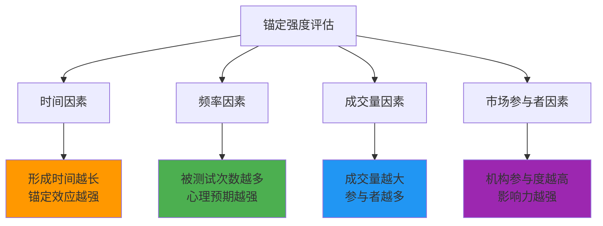

### 3.2 群体心理与市场周期

**市场周期本质上是群体心理周期**。技术分析的周期理论深刻反映了人类情绪的波动规律。

#### 3.2.1 市场情绪周期模型

**心理周期五阶段模型**

**阶段一：乐观萌芽期**
- **心理特征**：经历深度调整后，投资者开始谨慎乐观
- **行为表现**：聪明资金率先入场，成交温和放大
- **技术特征**：指数出现底部形态，领先指标率先走强
- **投资策略**：跟随聪明资金，分批布局优质标的

**阶段二：乐观扩散期**
- **心理特征**：市场信心逐步建立，投资者参与度提高
- **行为表现**：增量资金持续流入，板块轮动开始
- **技术特征**：指数突破重要阻力位，均线系统多头排列
- **投资策略**：提高仓位，参与市场热点

**阶段三：乐观疯狂期**
- **心理特征**：投资者普遍亢奋，风险意识淡薄
- **行为表现**：全民炒股，新开户激增，杠杆融资放大
- **技术特征**：指数快速拉升，技术指标严重超买
- **投资策略**：逐步减仓，保持谨慎

**阶段四：恐慌蔓延期**
- **心理特征**：乐观预期破灭，恐慌情绪快速蔓延
- **行为表现**：集中抛售，流动性枯竭，踩踏事件频发
- **技术特征**：指数暴跌，重要支撑位接连失守
- **投资策略**：观望为主，等待情绪企稳

**阶段五：绝望筑底期**
- **心理特征**：投资者彻底绝望，对市场失去信心
- **行为表现**：成交极度萎缩，关注降至冰点
- **技术特征**：指数震荡筑底，出现底部形态
- **投资策略**：逢低布局，等待下一轮周期

#### 3.2.2 媒体情绪与市场走势

**媒体情绪的量化方法**

**情绪指标构建**：
- **正面新闻占比**：财经媒体正面报道数量/总报道数量
- **专家看多比例**：市场分析师看多观点占比
- **热搜指数**：股票相关词汇搜索指数变化
- **社交媒体情绪**：微博、雪球等平台情绪分析

**媒体情绪与市场关系**

**领先-滞后关系分析**：
- **极端乐观**：媒体情绪通常领先市场顶部1-2个月
- **极端悲观**：媒体情绪往往同步或略滞后于市场底部
- **情绪转换**：情绪从极端乐观转向悲观时，市场下跌速度最快

**实战应用案例**

**2020年3月疫情底**：
- 媒体情绪：极度悲观，几乎看不到正面报道
- 市场表现：美股四次熔断，投资者恐慌抛售
- 后续发展：在绝望中见底，随后开启强劲反弹

**2021年2月消费顶**：
- 媒体情绪：对消费股极度乐观，"永远持有"声音增多
- 市场表现：白酒等消费股估值达到历史高位
- 后续发展：消费板块开启长期调整

#### 3.2.3 逆向投资的心理机制

**逆向投资的理论基础**

逆向投资的成功在于利用群体心理偏差：

- **从众心理**：大多数人倾向于跟随主流观点
- **确认偏差**：投资者倾向于寻找支持自己观点的信息
- **可得性偏差**：近期和突出的信息更容易影响判断

**逆向投资的时机识别**

**市场顶部特征**：
- 媒体一致看多，负面消息被忽视
- 投资者普遍认为"这次不一样"
- 技术分析方法被普遍质疑
- 新手投资者大量入市

**市场底部特征**：
- 媒体一致看空，正面消息被忽视
- 经验丰富的投资者开始谨慎乐观
- 价值投资理念重新受到重视
- 市场出现极端便宜的价格

### 3.3 行为金融学增强的技术分析方法

**结合行为金融学可以大幅提升技术分析的有效性**。

#### 3.3.1 情绪指标的构建与应用

**综合情绪指数设计**

**核心构成要素**：

| 指标类别 | 具体指标 | 权重 | 数据来源 | 预警意义 |
|---------|----------|------|----------|----------|
| **交易行为** | 融资余额增速 | 25% | 交易所数据 | 杠杆情绪水平 |
| **市场广度** | 涨跌家数比 | 20% | 交易所数据 | 市场参与度 |
| **波动率** | VIX指数位置 | 20% | 期权市场 | 恐慌情绪强度 |
| **资金流向** | 北向资金净流入 | 15% | 港交所 | 外资态度 |
| **估值水平** | 市盈率分位数 | 10% | 市场数据 | 估值情绪 |
| **媒体情绪** | 新闻情感分析 | 10% | 媒体监测 | 公众情绪 |

**情绪指数应用法则**：

**极端区域识别**：
- **极度贪婪区**（>80）：市场过热，考虑减仓
- **贪婪区**（60-80）：市场偏热，谨慎操作
- **中性区**（40-60）：市场正常，常规操作
- **恐惧区**（20-40）：市场偏冷，寻找机会
- **极度恐惧区**（<20）：机会区域，考虑加仓

#### 3.3.2 行为偏差的修正策略

**认知偏差的系统性修正**

**过度自信修正方法**：
1. **建立决策清单**：强制评估投资决策的各个环节
2. **设定预期范围**：为预测设置合理的误差范围
3. **定期回顾分析**：客观评估历史预测的准确性
4. **分散决策**：避免过度依赖单一判断

**处置效应应对策略**：
1. **预设止损点**：在买入时就设定止损价位
2. **追踪止损机制**：让盈利股票继续表现
3. **定期强制评估**：定期强制评估持仓股票
4. **逆向思维训练**：刻意思考相反的可能性

**锚定效应突破技巧**：
1. **多重参考点**：使用不同的估值和定价基准
2. **情景分析**：在不同情景下评估资产价值
3. **定期重新定价**：定期重新评估投资标的
4. **外部验证**：寻求独立第三方的意见

#### 3.3.3 群体行为的交易策略

**跟随聪明的资金**

**聪明资金识别特征**：
- **机构资金流向**：关注大型基金的持仓变化
- **内幕交易监管**：合法内幕人的交易行为
- **期权市场活动**：大额期权交易的异动
- **跨境资金流动**：国际资本的市场配置

**群体行为的反向利用**

**拥挤交易识别**：
- **持仓集中度**：某个主题或板块持仓过度集中
- **估值泡沫**：与历史均值显著偏离的估值水平
- **媒体关注度**：媒体过度关注的投资主题
- **散户参与度**：散户投资者大量涌入的迹象

**反向策略实施**：
1. **识别极端情绪**：通过情绪指标识别市场极端状态
2. **确认基本面支撑**：确保有基本面因素支撑反向操作
3. **分批建仓**：避免一次性大额反向操作
4. **严格止损**：设置明确的止损标准

### 3.4 行为金融学在风险管理中的应用

**理解行为偏差有助于构建更有效的风险管理体系**。

#### 3.4.1 基于行为风险的资金管理

**行为风险识别框架**

**主要行为风险类型**：

| 风险类型 | 表现特征 | 影响程度 | 监测指标 | 应对措施 |
|---------|----------|----------|----------|----------|
| **过度交易风险** | 高频交易，成本增加 | 高 | 换手率、交易成本 | 设定交易频率限制 |
| **追涨杀跌风险** | 情绪化决策，错失机会 | 极高 | 买入点相对位置 | 强制定期评估 |
| **集中持仓风险** | 过度自信，忽视分散 | 中高 | 持仓集中度 | 强制分散化要求 |
| **杠杆过度风险** | 过度自信，忽视风险 | 极高 | 杠杆比率 | 严格杠杆限制 |
| **止损失效风险** | 处置效应，拒绝止损 | 高 | 止损执行率 | 自动止损机制 |

**行为风险控制机制**

**事前预防措施**：
1. **投资规则明确化**：制定详细的投资规则和纪律
2. **决策流程标准化**：建立标准化的投资决策流程
3. **风险限额设定**：设定明确的风险承担限额
4. **定期强制评估**：定期强制评估投资决策

**事中监控措施**：
1. **实时风险监控**：建立实时风险监控系统
2. **行为偏差预警**：设置行为偏差预警指标
3. **强制冷静期**：在极端市场设置强制冷静期
4. **独立风险审查**：建立独立的风险审查机制

**事后纠正措施**：
1. **交易回顾分析**：定期回顾分析交易决策
2. **偏差统计追踪**：统计追踪个人行为偏差
3. **持续教育改进**：持续进行投资者教育
4. **策略动态调整**：根据行为特征调整策略

## 四、支撑与阻力分析体系

### 4.1 支撑阻力形成的心理机制与基本原则

**支撑阻力不是神奇的技术指标，而是基于市场参与者心理行为的客观规律**。理解支撑阻力背后的心理机制，是正确运用这一分析工具的前提。支撑阻力的形成源于投资者的记忆、恐惧、贪婪和希望等复杂心理因素。

#### 4.1.1 支撑阻力形成的心理学基础

**三大心理机制支撑支撑阻力的有效性**

| 心理机制 | 具体表现 | 市场影响 | 支撑阻力强度 |
|---------|----------|----------|-------------|
| **锚定效应** | 投资者倾向于记住重要的价格点位 | 在相同价位产生买卖行为 | 形成价格记忆支撑阻力 |
| **盈亏心理** | 解套需求和止损需求的集中体现 | 在关键价位产生大量交易 | 形成交易密集支撑阻力 |
| **羊群效应** | 投资者跟随多数人的行为模式 | 在共识价位产生集中行动 | 形成群体心理支撑阻力 |

**支撑阻力转换的心理学解释**

**支撑转换为阻力的心理过程**：
1. **套牢盘形成**：价格跌破支撑位，大量投资者被套
2. **解套需求积累**：价格反弹至原支撑位时，套牢盘急于解套
3. **卖压集中释放**：大量卖出在同一价位涌现，形成新的阻力
4. **群体记忆强化**：失败的反弹经历强化了该价位阻力的心理预期

**阻力转换为支撑的心理过程**：
1. **突破确认**：价格有效突破阻力位，确认上涨趋势
2. **踏空资金入场**：错过突破的投资者等待回调机会
3. **买托支撑形成**：在原阻力位出现大量买盘承接
4. **新成本锚定**：突破后建仓的投资者将该价位设为止损参考

#### 4.1.2 支撑阻力的三大核心原则体系

**核心原则的系统化分析**

| 原则类型 | 核心机理 | 实战识别 | 强度判断 | 历史成功率 |
|---------|----------|----------|----------|------------|
| **前期高低点原则** | 历史价格记忆锚定效应 | 6个月以上的重要转折点 | 成交量越大，持续时间越长 | 75-80% |
| **支撑转换原则** | 市场参与者成本结构变化 | 突破后的回踩确认 | 突破前停留时间越长越有效 | 80-85% |
| **趋势转换原则** | 动态趋势中的心理预期移动 | 均线系统、趋势线动态支撑 | 趋势角度适中时最有效 | 70-75% |

**前期高低点原则的深度应用**

**识别标准与强度评估**：
- **时间筛选**：重点关注6个月至2年内的高低点，3年以上的作用逐渐减弱
- **成交量验证**：形成高低点时的成交量越大，支撑阻力作用越强
- **次数统计**：同一价格水平被触及次数越多，支撑阻力强度越高
- **间隔分析**：两次触及的间隔时间越长，该价位的重要性越高

**实战案例：A股3000点的多重身份**
- **历史高低点**：2007年、2015年、2018年多次重要转折
- **整数关口**：心理层面的重要整数价位
- **政策关口**：多项政策以3000点为参考基准
- **成本密集**：大量投资者的持仓成本集中在该区域

**支撑转换原则的实战技巧**

**转换确认的三重验证**：
1. **时间验证**：价格在转换点位停留超过3-5个交易日
2. **空间验证**：突破幅度达到原位置的3-5%
3. **成交量验证**：突破时的成交量显著放大（至少1.5倍）

**强度变化规律**：
- **破位前停留时间**越长，转换后的作用**越强**
- **突破时的成交量**越大，转换后的可靠性**越高**
- **回踩确认的次数**越多，转换后的支撑阻力**越稳固**

**趋势转换原则的动态应用**

**均线系统的支撑阻力层级**：
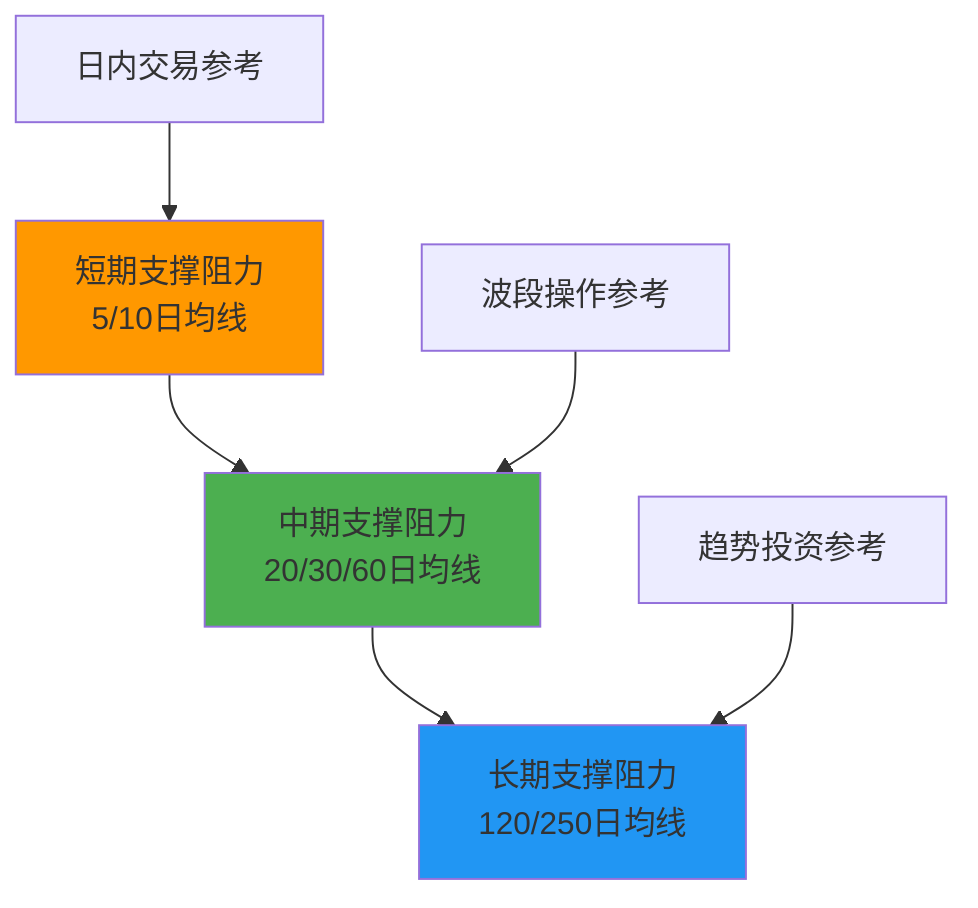

**趋势线角度与有效性关系**：
- **45度角趋势线**：最具参考价值，反映稳定的趋势力量
- **过陡趋势线**（>60度）：趋势过热，容易快速反转
- **过缓趋势线**（<30度）：趋势力度不足，容易破坏

#### 4.1.3 支撑阻力的五重验证体系

**单一信号存在误导性，多重验证才能提高判断准确性**。建立系统的验证框架，是专业投资者与业余投资者的关键区别。

**五重验证要素详解**

**1. 价格验证（空间维度）**
- **触及次数**：同一价位被触及3次以上确认有效性
- **触及间隔**：每次触及的时间间隔>2周
- **反弹幅度**：从支撑位反弹或从阻力位回调的幅度>5%

**2. 时间验证（时间维度）**
- **形成时间**：支撑阻力形成时间>3个月
- **持续时间**：支撑阻力作用持续时间>6个月
- **历史重现**：在不同周期中反复出现

**3. 成交量验证（能量维度）**
- **形成时成交量**：形成支撑阻力时成交量显著放大
- **触及时成交量**：再次触及时成交量出现规律性变化
- **突破时成交量**：真突破必须有成交量配合

**4. 技术形态验证（结构维度）**
- **形态组合**：与其他技术形态形成共振
- **指标确认**：多个技术指标同时发出信号
- **周期同步**：不同时间周期的分析一致

**5. 基本面验证（价值维度）**
- **估值支撑**：股价处于合理估值区间
- **业绩支撑**：公司基本面良好，盈利能力稳定
- **行业周期**：符合行业发展趋势和周期规律

**综合评分体系**

| 验证维度 | 权重分配 | 评分标准 | 最高得分 |
|---------|----------|----------|----------|
| **价格验证** | 25% | 触及次数、反弹幅度 | 25分 |
| **时间验证** | 20% | 形成时间、持续时间 | 20分 |
| **成交量验证** | 25% | 形成时、触及时、突破时 | 25分 |
| **技术形态验证** | 20% | 形态组合、指标确认 | 20分 |
| **基本面验证** | 10% | 估值、业绩、行业 | 10分 |

**操作决策标准**：
- **80分以上**：强支撑阻力，可作为重要进出场参考
- **60-80分**：中等强度支撑阻力，谨慎使用
- **60分以下**：弱支撑阻力，不宜作为主要决策依据

### 4.2 趋势线的实战应用与进阶技巧

**趋势线是技术分析中最直观、最有效的工具之一**。一条正确的趋势线能够帮助投资者识别趋势方向、把握进出场时机、设置合理止损位。然而，绘制和使用趋势线需要掌握系统的方法和技巧。

**理解了支撑阻力的深层心理机制后，我们继续学习趋势线的实战应用**。趋势线是支撑阻力分析的延伸和具体应用工具。

#### 4.2.1 趋势线的科学绘制方法

**趋势线绘制的核心技术规范**

**基础绘制原则**：
- **支撑线**：连接两个或更多递增的低点，预测未来的支撑价位
- **阻力线**：连接两个或更多递减的高点，预测未来的阻力价位
- **通道线**：与趋势线平行的辅助线，形成价格运行通道

**技术规范要求**：

| 技术要素 | 具体要求 | 重要性说明 | 违规后果 |
|---------|----------|------------|----------|
| **连接点数** | 至少3个点，2个点仅供参考 | 点数越多，可靠性越高 | 容易产生主观偏差 |
| **时间跨度** | 至少涵盖1个月以上的价格走势 | 时间越长，参考价值越高 | 可能反映短期波动而非趋势 |
| **角度控制** | 45度角左右最理想，30-60度可接受 | 反映趋势的可持续性 | 过陡或过缓都会降低有效性 |
| **接触频率** | 触及点应均匀分布，不应集中在某一区域 | 体现趋势的连续性 | 可能反映局部特征而非整体趋势 |
| **突破确认** | 需要3%的价格突破和3个交易日确认 | 避免假突破的干扰 | 增加决策错误的风险 |

**趋势线绘制实战步骤**

**步骤一：识别趋势方向**
- 上升趋势：连接递增的低点，形成支撑线
- 下降趋势：连接递减的高点，形成阻力线
- 横盘趋势：在震荡区间内画出上下边界线

**步骤二：选择连接点位**
- **重要性排序**：重要转折点 > 次要转折点 > 普通转折点
- **时间优先**：近期点位权重高于远期点位
- **成交量配合**：成交量大的点位优先考虑

**步骤三：验证趋势线有效性**
- **回测检验**：检查历史价格是否对趋势线有良好反应
- **调整优化**：根据市场变化适时调整趋势线位置和角度
- **多重确认**：与其他技术指标相互验证

#### 4.2.2 趋势线突破的识别与应对策略

**趋势线突破是趋势可能发生变化的重要信号**，但并非所有突破都具有相同的操作价值。建立系统的突破识别和应对机制，是提高交易成功率的关键。

**突破信号的等级分类**

| 信号等级 | 突破特征 | 成功率 | 建议操作 | 风险控制 |
|---------|----------|--------|----------|----------|
| **强势信号** | 大成交量突破 + 幅度>5% + 时间>5日 | 85-90% | 立即跟随，重仓操作 | 设置宽松止损 |
| **确认信号** | 中等成交量突破 + 幅度>3% + 时间>3日 | 70-80% | 逐步跟随，中等仓位 | 设置标准止损 |
| **弱信号** | 小成交量突破 + 幅度>2% + 时间>2日 | 50-60% | 观望为主，试探建仓 | 设置严格止损 |
| **假信号** | 无成交量配合 + 幅度<2% + 时间<2日 | 20-30% | 逆向操作，保持观望 | 不设置新仓位 |

**真突破与假突破的识别技巧**

**真突破的典型特征**：
1. **成交量配合**：突破时成交量至少为近期平均量的1.5倍以上
2. **突破幅度**：价格突破趋势线达到3%以上的空间
3. **时间确认**：突破状态维持3个交易日以上
4. **回踩确认**：突破后价格回踩原趋势线获得有效支撑或阻力
5. **形态配合**：突破时有其他技术形态配合（如头肩底颈线突破）

**假突破的常见特征**：
1. **成交量萎缩**：突破时成交量明显不足
2. **幅度有限**：突破幅度小于2%，很快回到原趋势线内
3. **时间短暂**：突破状态仅维持1-2个交易日
4. **多次失败**：在相同位置多次尝试突破但均告失败
5. **背离信号**：出现技术指标背离，不支持突破

**突破后的操作策略**

**突破确认后的操作时机**：
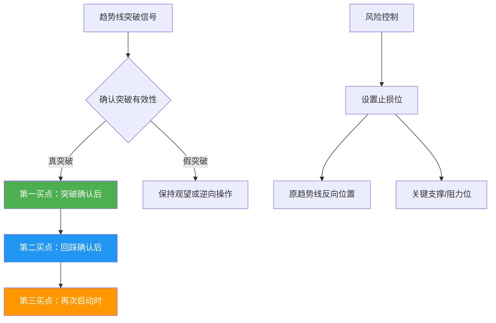

**仓位管理策略**：
- **突破初期**：试探性建仓10-20%，确认有效后再加仓
- **回踩确认**：回踩成功后加仓至目标仓位40-60%
- **趋势延续**：趋势得到确认并延续后，可重仓至70-80%
- **风险控制**：任何单笔交易的止损不超过总资金的2%

#### 4.2.3 趋势线的进阶应用技巧

**掌握基础技巧后，可以运用更高级的趋势线分析方法来提升判断精度**

**趋势线角度与趋势强度分析**

**角度-强度对应关系**：
- **45度趋势线**：**最理想趋势线**，反映健康稳定的趋势
- **30-45度趋势线**：**温和趋势线**，趋势力度适中但可持续性强
- **45-60度趋势线**：**强势趋势线**，趋势力度强但可能过度延伸
- **<30度趋势线**：**弱势趋势线**，趋势力度不足，容易失效
- **>60度趋势线**：**极端趋势线**，趋势过热，随时可能反转

**趋势线角度变化预警**：
- **角度增大**：趋势加速，可能进入最后冲刺阶段
- **角度减小**：趋势衰竭，可能出现转折
- **角度稳定**：趋势健康，可继续持有

**多重趋势线共振分析**

**不同时间周期趋势线的配合应用**：
- **长期趋势线**：用周线或月线绘制，确定主要趋势方向
- **中期趋势线**：用日线绘制，把握主要波段机会
- **短期趋势线**：用60分钟或日线绘制，精确进出场时机

**共振信号识别**：
- **多重突破**：多个时间周期的趋势线同时被突破
- **角度一致**：不同周期趋势线的角度趋于一致
- **交汇确认**：多条趋势线在同一价位交汇，形成强支撑/阻力

**趋势线与其他指标的组合应用**

**趋势线 + 均线系统**：
- 趋势线确定趋势方向，均线确定具体买卖点位
- 价格同时突破趋势线和均线，信号可靠性大幅提升

**趋势线 + 成交量**：
- 突破趋势线时必须有成交量的配合
- 趋势线附近成交量的变化预示突破的可能性

**趋势线 + 技术指标**：
- MACD、RSI等指标出现背离，预示趋势线可能被突破
- 指标与趋势线同向，确认趋势的有效性

## 四、技术形态分析与实战应用

### 4.1 技术形态的系统分类与识别框架

**技术形态分析是技术分析中最直观、最有效的工具之一**。形态的本质是市场参与者群体行为的可视化表达，反映了多空力量对比的变化。掌握形态分析，就是掌握市场语言的能力。

#### 4.1.1 形态分类体系与心理机制

**技术形态的系统分类**

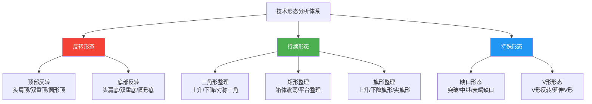

**形态形成的心理学解释**

| 形态类型 | 心理机制 | 市场参与者的行为模式 | 可靠性评级 |
|---------|----------|----------------------|------------|
| **头肩形态** | 趋势衰竭的必然过程 | 从信心十足→怀疑→绝望 | ⭐⭐⭐⭐⭐ (85-90%) |
| **双重形态** | 市场对关键价位的测试 | 两次试探确认阻力/支撑 | ⭐⭐⭐⭐ (75-80%) |
| **矩形形态** | 多空力量暂时均衡 | 在价格区间内换手整理 | ⭐⭐⭐⭐ (80-85%) |
| **三角形形态** | 趋势动能的逐步释放 | 波动幅度逐渐收窄 | ⭐⭐⭐ (65-75%) |

#### 4.1.2 经典形态的深度解析

**头肩形态：可靠性的王者**

**形态结构的科学分析**：
- **左肩**：第一次上攻失败，成交量放大，但未能创出新高
- **头部**：第二次上攻创出新高，但成交量相对萎缩，显示动能不足
- **右肩**：第三次上攻未能达到头部高度，成交量进一步萎缩
- **颈线**：连接左肩和右肩回调低点的关键支撑/阻力位

**目标测量技术**：
- **测量方法**：从头部到颈线的垂直距离
- **目标价位**：颈线突破后，按测量距离向突破方向延伸
- **时间验证**：形态形成时间越长，突破后目标越可靠

**实战要点**：
- **颈线斜率**：理想状态下颈线基本水平，斜率过大会降低可靠性
- **成交量配合**：左肩成交量最大，头部次之，右肩最小
- **突破确认**：颈线突破需要3%的空间和3个交易日的时间确认

**双重形态：测试与确认的艺术**

**双重顶的关键特征**：
- **价格高度**：两个高点基本相等，误差不超过3%
- **时间间隔**：两个高点之间间隔1-3个月
- **中间回调**：两个高点之间有明显回调，幅度>10%
- **颈线突破**：跌破中间回调的低点确认形态完成

**双重底的特殊要求**：
- **筑底时间**：通常比双重顶需要更长时间
- **成交量要求**：右底成交量必须明显放大，显示买盘积极
- **突破确认**：需要更大的成交量和更长时间来确认突破

**持续形态：趋势中的加油站**

**矩形形态的市场含义**：
- **形成原因**：市场在某个价格区间内达成临时平衡
- **时间特征**：持续时间为1-6个月，时间越长蓄势越充分
- **突破特征**：突破时必须有显著成交量放大
- **目标计算**：突破后目标价位等于矩形高度

**三角形形态的分类应用**：
- **上升三角形**：每次回调都在抬高低点，显示买盘积极，通常向上突破
- **下降三角形**：每次反弹都在降低高点，显示卖盘沉重，通常向下突破
- **对称三角形**：高低点同时向内收敛，突破方向具有随机性

#### 4.1.2 形态突破的确认机制

**避免假突破需要建立严格的确认标准**：

**空间标准**：
- **突破幅度**：价格突破形态边界3%以上确认有效
- **最小涨幅**：矩形形态突破后至少上涨形态高度
- **风险控制**：突破失败时最大损失不超过3%

**时间标准**：
- **确认时间**：突破状态维持3-5个交易日
- **根据波动率调整**：高波动率股票延长确认时间
- **成交量确认**：向上突破需要连续放量

**折返确认**：
- **回踩测试**：突破后价格折返到原边界获得支撑/阻力
- **二次突破**：回踩后的再次突破更加可靠
- **失败信号**：价格回到形态内部表明突破失败

### 4.2 头肩形态的实战要点

#### 4.2.1 形态结构与颈线位

**头肩形态是可靠性最高的反转形态之一**：
- **头肩顶**：左肩-头部-右肩的结构，颈线位跌破确认头部反转
- **头肩底**：倒置的头肩结构，颈线位突破确认底部反转
- **歪肩膀现象**：上升趋势中左肩低右肩高，下跌趋势中右肩低左肩高

**颈线位的关键作用**：
- **支撑阻力转换**：颈线位从支撑转为阻力或反之
- **突破确认**：颈线位突破是形态完成的确认信号
- **目标测量**：从颈线位到头部距离等于突破后的目标距离

#### 4.2.2 不同市场环境的有效性差异

**技术形态在不同市场位置的有效性存在显著差异**：

| 市场位置 | 形态有效性 | 原因分析 | 操作建议 |
|---------|------------|----------|----------|
| 顶部形态 | 85% | 投资者情绪亢奋，技术信号最可靠 | 果断减仓，严格止损 |
| 底部形态 | 65% | 关注度较低，大资金意志主导 | 分批建仓，控制仓位 |
| 中间区域 | 45% | 理性状态，技术分析胜率最低 | 谨慎操作，结合其他指标 |

**实战经验总结**：
- **顶部形态**：头肩顶和双重顶最为有效，失败率低于15%
- **底部形态**：需要更大成交量和更长时间确认
- **震荡市**：矩形形态和三角形形态效果较好

## 五、成交量分析的核心体系

**完成了技术形态的学习后，我们进入成交量的分析**。成交量是验证技术信号的重要工具，能够帮助我们识别趋势的真实性和持续性。

### 5.1 成交量的基本原则

#### 5.1.1 量价关系的核心规律

**量价关系反映了市场的内在动力结构**：

| 量价关系 | 市场含义 | 实战应用 | 成功概率 |
|---------|----------|----------|---------|
| 上涨放量，下跌缩量 | 健康上涨趋势 | 趋势延续概率大 | 80% |
| 价涨量缩 | 后继乏力 | 可能趋势逆转 | 70% |
| 价跌量增 | 空头力量增强 | 高位可能是下跌开始 | 75% |
| 放量滞涨 | 高位震荡出货 | 顶部重要信号 | 85% |
| 缩量阴跌 | 空头力量衰竭 | 可能接近底部 | 65% |

#### 5.1.2 关键的成交量信号

**成交量变化是趋势转折的重要领先指标**：

**底部放量**：
- **信号特征**：市场低点突然放量，通常是可靠的底部信号
- **确认标准**：成交量达到近期平均量的2倍以上
- **操作策略**：分批建仓，设置止损位
- **历史统计**：底部放量后3个月上涨概率75%

**顶部放量**：
- **信号特征**：高位放量滞涨，无法创新高，见顶重要标志
- **识别方法**：成交量创历史新高但价格未能创新高
- **预警时间**：通常领先价格顶部1-2个月
- **风险控制**：逐步减仓，不盲目追高

**突破放量**：
- **关键技术位放量**：表明外力介入，趋势可能改变
- **突破标准**：成交量达到前期平均量的1.5倍以上
- **持续性要求**：连续3个交易日放量
- **失败信号**：突破后成交量快速萎缩

### 5.2 市场广度指标分析

#### 5.2.1 腾落线(ADL)的应用

**腾落线衡量市场趋势的广度和健康度**：

**计算方法**：
- ADL = (上涨股票数 - 下跌股票数)的累计值
- 每日更新，形成连续曲线
- 与指数走势进行对比分析

**背离预警系统**：
- **顶背离预警**：大盘创新高但腾落线未确认，上涨进入尾声
- **同步见底**：腾落线经常与大盘同时见底，领先性不强
- **背离时间和深度**：背离时间越长、程度越深，未来跌幅越大

**实战应用案例**：
- **2020年末**：A股仅白酒板块上涨，腾落线与指数严重背离
- **结果**：2021年白酒板块大幅回调，市场风格切换

#### 5.2.2 投资者信心的量化方法

**必选消费相对强度模型**：

**理论基础**：
- **风险偏好逻辑**：投资者谨慎时偏好无周期、高分红的必选消费
- **股息率优势**：必选消费通常具有稳定的股息收益率
- **防御属性**：经济周期波动对必选消费影响较小

**操作信号体系**：
- **看跌信号**：大盘新高但必选消费未新高→市场风险偏好过度
- **看涨信号**：大盘下跌但必选消费走强→投资者开始谨慎布局
- **确认要求**：相对强度变化持续超过1个月

**A股有效性分析**：
- **2018年见底**：必选消费提前见底，信号有效性较好
- **整体表现**：相比美股，A股该指标有效性略低，约60%
- **改进方法**：结合其他指标如北向资金流向共同判断

## 六、移动平均线系统实战应用

### 6.1 移动平均线的理论基础

#### 6.1.1 移动平均线的本质含义

**移动平均线是市场平均成本的动态反映**：
- **成本锚定效应**：反映投资者的平均持仓成本
- **心理支撑阻力**：远离成本时获利了结，触及成本时解套离场
- **趋势指示器**：均线方向反映中长期趋势方向

**技术原理深度分析**：
- **平滑作用**：消除短期价格波动的随机性
- **滞后性**：对价格变化的反应存在时间延迟
- **趋势跟踪**：在趋势市场中表现优异
- **震荡失效**：在横盘震荡中频繁发出错误信号

#### 6.1.2 不同周期均线的实战选择

**均线系统的选择需要适应市场特征**：

| 均线周期 | 适用场景 | 特点 | 参数设置建议 |
|---------|----------|------|-------------|
| 短期均线(5-20日) | 强趋势市场 | 灵敏但容易反复穿越 | 5、10、20日组合 |
| 中期均线(30-60日) | 中等强度趋势 | 平衡灵敏性和稳定性 | 30、45、60日组合 |
| 长期均线(120-200日) | 长期趋势判断 | 稳定性强但滞后性明显 | 120、200、250日组合 |

**EMA与MA的选择**：
- **EMA优势**：对近期价格赋予更高权重，反应更快
- **MA优势**：计算简单，信号更稳定
- **实战建议**：短线交易使用EMA，长线投资使用MA
- **参数优化**：根据个股波动率调整EMA平滑系数

### 6.2 均线系统的实战策略

#### 6.2.1 200日均线的牛熊分界作用

**200日均线是判断市场长期趋势的关键指标**：

**牛熊分界标准**：
- **牛市特征**：价格在200日均线上方，均线方向向上
- **熊市特征**：价格在200日均线下方，均线方向向下
- **转换信号**：200日均线调平，股价上穿或回踩确认

**历史回测数据**：
- **美国市场**：1897-1967年，29个信号中20个有效，胜率69%
- **平均收益**：多头信号平均收益27%，空头信号减少损失4%
- **A股市场**：2000年以来，200日均线牛市判断准确率75%

**实战操作要点**：
- **最佳介入点**：200日均线调平，股价放量上穿
- **止损设置**：跌破200日均线且方向转向下时止损
- **仓位控制**：价格在200日均线上方时保持较高仓位

#### 6.2.2 均线交叉的确认条件

**均线交叉需要满足双重确认条件**：
1. **短期均线穿越长期均线**
2. **长期均线与短期均线方向一致**

**常见错误与修正**：
- **错误**：只关注交叉而忽视方向一致性，导致大量错误信号
- **修正**：等待长期均线确认方向后再做决策
- **过滤方法**：增加成交量确认条件

**金叉死叉的成功率统计**：
- **金叉成功**：在上升趋势中，金叉后6个月上涨概率70%
- **死叉成功**：在下降趋势中，死叉后6个月下跌概率65%
- **震荡市场**：金叉死叉成功率仅45%，应谨慎使用

## 七、技术指标的综合应用体系

### 7.1 动能指标的分类与选择

#### 7.1.1 指标的市场环境适应性

**不同技术指标适用于不同的市场环境**：

| 市场环境 | 推荐指标 | 避免指标 | 操作策略 |
|---------|----------|----------|----------|
| 趋势市场(上涨/下跌) | 移动平均线系统、MACD | 超买超卖指标 | 趋势跟踪 |
| 震荡市场(横盘) | KDJ、RSI、威廉指标 | 移动平均线系统 | 高抛低吸 |
| 强趋势市场 | 布林带、抛物线指标 | 震荡指标 | 顺势而为 |
| 弱震荡市场 | CCI、ROC指标 | 趋势指标 | 区间操作 |

**指标选择决策树**：
1. **判断市场状态**：使用ADX指标判断趋势强度
2. **趋势市场**：选择趋势跟踪指标，设置较宽止损
3. **震荡市场**：选择摆动指标，设置较紧止损
4. **混合策略**：在趋势末端开始使用震荡指标

#### 7.1.2 指标背离的分析方法

**背离分析是识别趋势转折的重要技术**：

**背离类型识别**：
- **顶背离**：价格创新高但指标未创新高，上涨动能衰竭
- **底背离**：价格创新低但指标未创新低，下跌动能衰减
- **隐藏背离**：价格未创新高但指标创新高（看涨），反之看跌

**多周期共振验证**：
- **日线背离**：短期信号，可靠性60%
- **周线背离**：中期信号，可靠性75%
- **月线背离**：长期信号，可靠性85%
- **多周期共振**：同时出现时可靠性超过90%

### 7.2 布林带的实战应用

#### 7.2.1 布林带的基本原理

**布林带通过统计波动率建立价格通道**：
- **中轨**：20日移动平均线
- **上下轨**：中轨±2倍标准差
- **带宽变化**：带宽收缩预示即将突破，带宽扩张趋势明确

**技术参数优化**：
- **标准设置**：20周期，2倍标准差
- **短线交易**：10周期，1.5倍标准差
- **长线投资**：50周期，2.5倍标准差
- **波动率调整**：高波动率股票增加标准差倍数

#### 7.2.2 布林带的操作信号

**布林带提供完整的操作信号体系**：

**1. 收缩信号（带口收紧）**：
- **信号特征**：带宽降至历史低位
- **预示意义**：即将发生大幅波动突破
- **操作策略**：准备突破交易，设置双向订单
- **成功率**：收缩后突破概率75%

**2. 突破信号**：
- **向上突破**：突破上轨为强上涨，追涨买入
- **向下突破**：突破下轨为强下跌，止损卖出
- **确认要求**：需要成交量配合突破
- **虚假突破**：20%的突破会快速回到带内

**3. 趋势信号**：
- **强势特征**：价格在中轨和上轨之间运行
- **弱势特征**：价格在中轨和下轨之间运行
- **趋势延续**：价格沿上轨或下轨运行
- **趋势转换**：价格穿越中轨后逆转

**4. 反转信号**：
- **顶部反转**：在上轨受阻后跌破中轨
- **底部反转**：在下轨支撑后突破中轨
- **确认标准**：连续3个收盘价在中轨另一侧
- **风险控制**：反转失败时及时止损

## 八、全面风险管理体系

### 8.1 现代风险管理框架

**风险管理是投资成功的基石，是技术分析体系中不可或缺的核心环节**。完善的风险管理不仅能够保护本金安全，更能在市场波动中保持心理稳定，为长期投资成功提供坚实保障。

#### 8.1.1 风险管理体系的四重维度

**全面风险管理的四个维度**

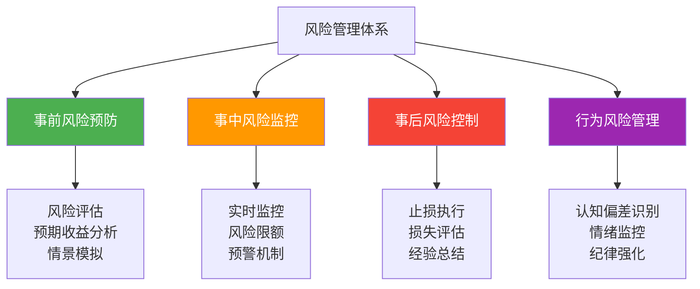

**事前风险预防体系**

**风险评估的科学方法**：

| 评估维度 | 核心指标 | 评估方法 | 风险等级划分 | 应对策略 |
|---------|----------|----------|-------------|----------|
| **市场风险** | Beta值、相关性 | VaR模型、压力测试 | 低<1.0中1.0-1.5高>1.5 | 分散化投资 |
| **流动性风险** | 换手率、成交量 | 流动性覆盖率 | 高>30%中15-30%低<15% | 控制集中度 |
| **波动风险** | 历史波动率、GARCH模型 | 波动率预测 | 低<15%中15-30%高>30% | 动态调整仓位 |
| **集中度风险** | 持仓集中度、行业集中度 | 赫芬达尔指数 | 低<0.1中0.1-0.3高>0.3 | 强制分散化 |

**预期收益分析框架**：

**收益预期三要素**：
1. **基础收益率**：基于历史数据和基本面的正常收益率
2. **风险溢价**：承担额外风险应获得的超额收益补偿
3. **特殊机会收益**：市场错误定价或短期失衡带来的收益机会

**情景模拟分析**：
- **乐观情景**：最佳市场环境下的收益潜力
- **中性情景**：正常市场条件下的预期收益
- **悲观情景**：不利市场环境下的最大损失
- **极端情景**：黑天鹅事件下的生存测试

**事中风险监控系统**

**实时监控的四大指标**：

| 监控类型 | 关键指标 | 预警阈值 | 监控频率 | 应对措施 |
|---------|----------|----------|----------|----------|
| **仓位监控** | 总仓位、单品种仓位 | 总仓位<80%，单股<20% | 实时 | 自动减仓 |
| **止损监控** | 浮亏比例、回撤幅度 | 浮亏<8%，回撤<15% | 每日 | 执行止损 |
| **相关性监控** | 投资组合相关性 | 相关性<0.7 | 每周 | 调整配置 |
| **波动率监控** | 投资组合波动率 | 波动率<25% | 每日 | 动态调仓 |

**风险限额设定原则**：

**分层限额体系**：
1. **账户总限额**：整体风险承受上限
2. **策略限额**：单个投资策略的风险上限
3. **品种限额**：单个投资品种的风险上限
4. **交易限额**：单笔交易的风险上限

**限额设定方法**：
- **绝对限额**：具体金额或百分比限制
- **相对限额**：相对于基准或历史的限制
- **动态限额**：根据市场条件调整的限额
- **触发限额**：达到特定条件时触发的限额

**事后风险控制机制**

**止损执行的三层机制**：

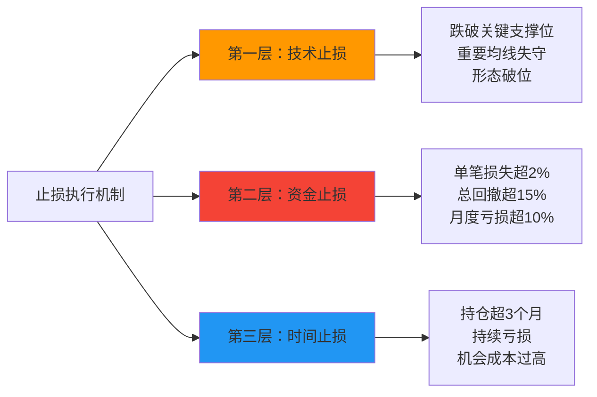

**损失评估与经验总结**：

**损失分类分析**：
- **正常损失**：预期内的市场波动损失
- **异常损失**：超出预期的异常情况
- **操作失误**：由于判断错误或执行偏差造成的损失
- **系统性损失**：整个投资体系存在问题的损失

**经验总结机制**：
1. **交易记录分析**：详细分析每笔亏损交易的原因
2. **决策过程回顾**：评估决策逻辑和执行过程
3. **改进措施制定**：针对问题制定具体改进方案
4. **执行效果跟踪**：跟踪改进措施的执行效果

#### 8.1.2 资金管理的科学方法

**凯利公式的实战应用**

**凯利公式优化版本**：

```
最优仓位比例 = (胜率 × 收益倍数 - 败率) / 收益倍数 × 调整系数
```

**参数设定指导**：
- **胜率统计**：基于至少50次交易的历史统计
- **收益倍数**：平均盈利与平均亏损的比值
- **调整系数**：0.25-0.5之间，避免过度自信

**实战应用案例**：
- 胜率60%，收益倍数2:1的策略
- 凯利公式计算：(0.6 × 2 - 0.4) / 2 = 0.4
- 考虑调整系数0.5：最优仓位 = 0.4 × 0.5 = 20%

**分批建仓与动态调仓策略**

**分批建仓的科学方法**：

| 建仓阶段 | 建仓比例 | 触发条件 | 风险控制 | 目标效果 |
|---------|----------|----------|----------|----------|
| **试探性建仓** | 10-15% | 初步信号出现 | 严格止损 | 验证信号有效性 |
| **确认性建仓** | 20-30% | 信号得到确认 | 适度止损 | 建立基本仓位 |
| **加仓阶段** | 30-40% | 趋势延续确认 | 移动止损 | 扩大盈利仓位 |
| **满仓阶段** | 50-60% | 强势趋势确认 | 宽幅止损 | 把握主要趋势 |

**动态调仓的触发条件**：
1. **市场环境变化**：经济周期、政策环境重大变化
2. **风险水平变化**：波动率、相关性发生显著变化
3. **投资机会变化**：出现更好的投资机会
4. **时间因素变化**：达到预设的持仓时间限制

### 8.2 不同市场环境的风险管理策略

**市场环境决定风险管理的重点和方法**。

#### 8.2.1 趋势市场的风险管理

**上升趋势的风险管理策略**

**顺势而为的风险控制**：

**金字塔式加仓法**：
- **基础仓位**：在趋势确认初期建立20-30%仓位
- **第一次加仓**：趋势延续且技术确认，加仓至40-50%
- **第二次加仓**：趋势强劲延续，加仓至60-70%
- **最终仓位**：在趋势末期控制在70%以下

**上升趋势的止损策略**：
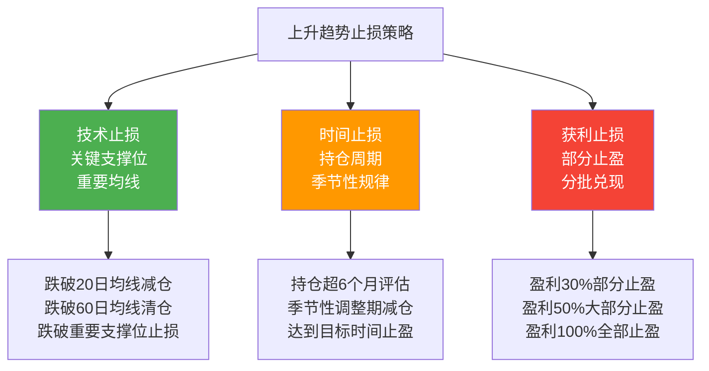

**下降趋势的风险管理策略**

**熊市生存法则**：

**保守型防御策略**：
- **仓位控制**：总仓位不超过30%
- **现金储备**：保持40-60%现金
- **债券配置**：配置20-30%高评级债券
- **黄金配置**：配置5-10%黄金作为避险

**抢反弹的风险控制**：
- **仓位限制**：单笔反弹仓位不超过10%
- **止损设置**：设置5%的严格止损
- **时间控制**：持仓时间不超过1个月
- **目标收益**：达到8-10%收益立即止盈

#### 8.2.2 震荡市场的风险管理

**震荡市场的风险特征**：

**区间操作的风险管理**：

**网格交易策略**：
- **网格密度**：根据波动率设置网格间距
- **仓位分配**：将资金分成10-20份
- **买入规则**：每下跌一格买入一份
- **卖出规则**：每上涨一格卖出一份
- **风险控制**：设置总仓位上限和止损线

**震荡市场的风险预警指标**：

| 预警指标 | 计算方法 | 预警阈值 | 风险含义 | 应对策略 |
|---------|----------|----------|----------|----------|
| **波动率指数** | 历史波动率 | VIX > 30 | 市场焦虑加剧 | 降低仓位 |
| **区间突破** | 价格突破区间边界 | 3%突破幅度 | 趋势可能形成 | 调整策略 |
| **相关性集中** | 投资组合相关性 | 相关性 > 0.8 | 系统性风险增加 | 分散投资 |
| **流动性枯竭** | 成交量变化 | 成交量 < 50% | 市场关注度下降 | 减少交易 |

#### 8.2.3 极端市场的风险应对

**黑天鹅事件的应对策略**

**危机预警的早期信号**：

**市场恐慌指标**：
- **VIX指数**：超过40表示极度恐慌
- **信用利差**：高评级债与国债利差急剧扩大
- **资金流向**：大规模资金从风险资产撤离
- **媒体情绪**：主流媒体开始集体悲观

**危机应对的四个阶段**：

1. **预警阶段**（危机前1-3个月）
   - 逐步降低风险资产仓位
   - 增加现金和避险资产
   - 建立危机应对预案
   - 密切监控预警指标

2. **危机初期**（危机开始1-2周）
   - 快速降低仓位至20%以下
   - 保持充足流动性
   - 避免盲目抄底
   - 关注政策应对措施

3. **危机中期**（危机持续1-3个月）
   - 保持耐心，等待时机
   - 研究优质资产
   - 小仓位试探性建仓
   - 关注企稳信号

4. **危机后期**（危机企稳后）
   - 逐步增加仓位
   - 布局长期机会
   - 控制建仓节奏
   - 避免追高操作

### 8.3 行为风险与心理管理

**最大的风险往往来自于投资者自身**。

#### 8.3.1 认知偏差的风险识别

**常见认知偏差的风险评估**：

| 认知偏差 | 风险表现 | 检测方法 | 风险等级 | 纠正措施 |
|---------|----------|----------|----------|----------|
| **过度自信** | 仓位过重，频繁交易 | 交易频率统计，仓位分析 | 极高 | 强制仓位限制 |
| **确认偏差** | 只看有利信息 | 信息来源多样性分析 | 高 | 强制看反面观点 |
| **处置效应** | 持亏卖盈 | 持仓时间统计，止损率分析 | 高 | 自动止损机制 |
| **锚定效应** | 固执于历史价格 | 价格参考点分析 | 中 | 多重参考体系 |
| **羊群效应** | 跟风操作 | 独立决策比例统计 | 中 | 建立独立分析框架 |

**行为偏差的量化监控**：

**行为风险评分体系**：
- **交易频率评分**：基于历史平均交易频率的偏离程度
- **仓位控制评分**：基于建议仓位的偏离程度
- **止损执行评分**：基于止损策略的执行情况
- **独立决策评分**：基于独立分析判断的频率

#### 8.3.2 情绪管理的实战技巧

**情绪自我调节的方法**：

**投资决策前的情绪检查**：

| 检查项目 | 具体内容 | 判断标准 | 风险等级 | 应对措施 |
|---------|----------|----------|----------|----------|
| **情绪状态** | 贪婪、恐惧、焦虑程度 | 情绪指数1-10 | >7分高风险 | 推迟决策 |
| **决策压力** | 时间压力、业绩压力 | 压力指数1-10 | >8分高风险 | 寻求建议 |
| **信息充分性** | 信息收集和分析程度 | 信息完整度1-10 | <6分高风险 | 深入研究 |
| **决策独立性** | 受他人影响程度 | 独立性评分1-10 | <5分高风险 | 独立思考 |

**极端情绪的应对策略**：

**贪婪情绪的应对**：
1. **强制冷静期**：设置24小时决策冷静期
2. **风险评估**：重新评估风险收益比
3. **仓位控制**：强制降低仓位
4. **反向思考**：考虑可能的风险因素

**恐惧情绪的应对**：
1. **数据验证**：用客观数据验证情绪判断
2. **历史比较**：与历史类似情况比较
3. **分批操作**：避免一次性大额决策
4. **专业咨询**：寻求独立专业意见

#### 8.3.3 投资纪律的建立与执行

**纪律建设的核心要素**：

**投资规则清单**：

**买入前检查清单**：
- [ ] 风险收益比是否满足要求
- [ ] 仓位是否符合风险管理要求
- [ ] 是否进行了充分的基本面分析
- [ ] 技术信号是否得到多重确认
- [ ] 是否设置了明确的止损点
- [ ] 是否有详细的退出计划

**持有期间检查清单**：
- [ ] 投资逻辑是否仍然有效
- [ ] 风险因素是否发生变化
- [ ] 是否达到止盈或止损条件
- [ ] 是否需要调整仓位
- [ ] 是否有更好的投资机会

**纪律执行的工具**：

**自动化执行工具**：
- **止损单**：自动执行止损策略
- **仓位监控**：自动监控仓位限制
- **风险预警**：自动发送风险预警
- **投资日志**：自动记录投资决策

**纪律执行的监督机制**：
1. **定期回顾**：每周回顾投资决策执行情况
2. **第三方监督**：请他人监督投资决策
3. **奖惩机制**：建立自我奖惩机制
4. **持续改进**：不断优化投资纪律体系

### 8.4 风险管理的技术工具与系统

**现代技术为风险管理提供了强大的工具支持**。

#### 8.4.1 量化风险模型

**VaR模型及其应用**

**VaR（Value at Risk）计算方法**：

**历史模拟法**：
- 基于历史数据计算最大可能损失
- 计算简单，适用于所有资产
- 依赖历史数据，对极端事件估计不足

**蒙特卡洛模拟**：
- 通过随机模拟计算风险价值
- 可以考虑复杂的风险因素
- 计算复杂，需要大量计算资源

**参数法**：
- 假设收益率服从特定分布
- 计算快速，便于实时监控
- 依赖分布假设，可能低估极端风险

**VaR实战应用案例**：

**投资组合VaR分析**：
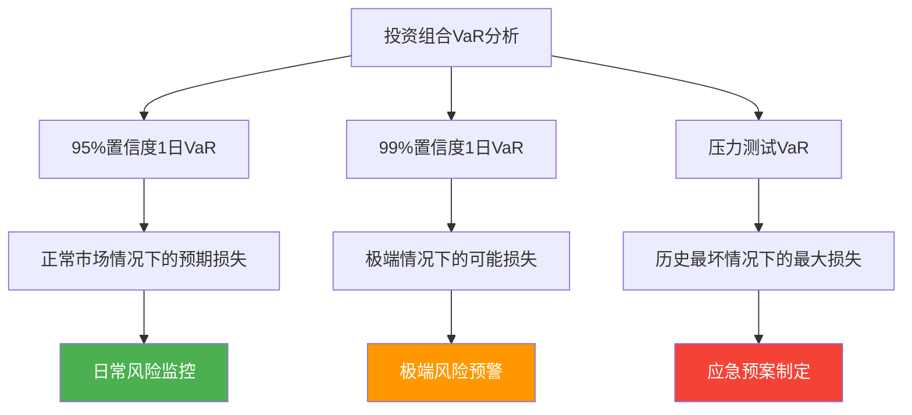

#### 8.4.2 实时风险监控系统

**风险监控的核心指标**：

**实时监控指标体系**：

| 监控类别 | 关键指标 | 监控频率 | 预警阈值 | 自动化程度 |
|---------|----------|----------|----------|------------|
| **仓位监控** | 总仓位、单品种仓位 | 实时 | 仓位超限 | 100%自动化 |
| **市场风险** | Beta、相关性 | 每小时 | 风险超标 | 80%自动化 |
| **流动性风险** | 换手率、买卖价差 | 每日 | 流动性不足 | 60%自动化 |
| **波动风险** | 波动率、GARCH | 每日 | 波动率过高 | 70%自动化 |
| **集中度风险** | 赫芬达尔指数 | 每日 | 集中度超标 | 90%自动化 |

**风险预警的多级体系**：

**预警级别划分**：
1. **绿色预警**：风险水平正常，持续监控
2. **黄色预警**：风险水平偏高，加强关注
3. **橙色预警**：风险水平较高，需要采取措施
4. **红色预警**：风险水平极高，立即采取行动

**预警响应机制**：
- **绿色预警**：继续正常操作
- **黄色预警**：减少新建仓位，加强监控
- **橙色预警**：降低整体仓位，设置严格止损
- **红色预警**：大幅降低仓位，考虑清仓避险

#### 8.4.3 风险管理的IT系统架构

**风险管理系统的核心模块**：

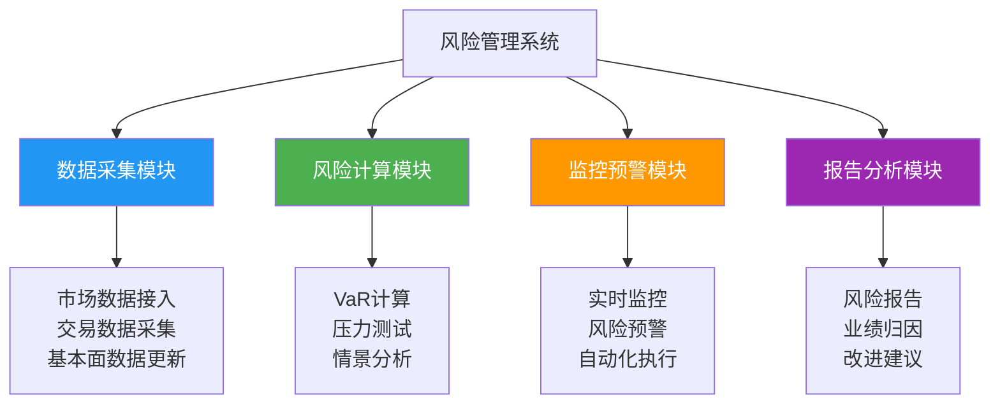

**系统集成要求**：

**数据接口标准**：
- **实时数据**：支持高频数据实时更新
- **历史数据**：提供完整的历史数据回溯
- **外部数据**：集成第三方数据和资讯
- **内部数据**：整合内部交易和持仓数据

**计算性能要求**：
- **实时计算**：支持毫秒级实时风险计算
- **批量计算**：支持大规模批量数据处理
- **并发处理**：支持多用户并发访问
- **扩展性**：支持业务规模扩展

## 九、市场结构与板块轮动

### 9.1 指数相互验证体系

**在完成了行为金融学和风险管理的学习后，我们进入市场结构的分析**。指数相互验证是理解市场整体健康状况的重要工具，能够帮助投资者识别结构性机会和风险。

#### 9.1.1 主要指数的功能定位

**不同指数有不同的分析价值**：

**道琼斯工业指数**：
- **构成特点**：30只传统行业股票价格加权
- **反映内容**：传统制造业和工业股表现
- **局限性**：科技股覆盖不足，代表性下降
- **使用价值**：长期趋势分析，历史比较

**标普500指数**：
- **构成特点**：500只股票市值加权，覆盖90%流通市值
- **反映内容**：美国股市整体表现
- **优势**：行业分布均衡，代表性强
- **使用价值**：市场基准，机构投资者参考

**纳斯达克指数**：
- **构成特点**：科技股为主，包括生物技术等新兴产业
- **反映内容**：科技创新和成长股表现
- **特点**：波动性较大，成长性突出
- **使用价值**：科技行业景气度指标

**威尔逊5000指数**：
- **构成特点**：全市场活跃股，等权重计算
- **反映内容**：市场广度和平均表现
- **优势**：避免大盘股过度影响
- **使用价值**：市场广度分析

#### 8.1.2 指数背离的实战意义

**指数背离是市场结构变化的重要预警**：

**历史经典案例**：

**1968年案例**：
- **背离现象**：标普500创历史新高，道琼斯未确认
- **市场结构**：少数大盘股推动指数上涨
- **后续走势**：随后市场下跌40%
- **持续时间**：熊市持续18个月

**1974年案例**：
- **背离现象**：道琼斯创新低，标普500未确认
- **市场结构**：成长股相对抗跌
- **后续走势**：市场反弹80%
- **反转特征**：成长股率先见底

**2000年案例**：
- **背离现象**：道琼斯创新高，纳指未确认
- **市场结构**：传统蓝筹与科技股分化
- **后续走势**：互联网泡沫破裂
- **教训**：技术板块估值过高

**A股案例**：
- **2015年**：上证指数与创业板指背离
- **2018年**：上证50与中小板指分化
- **2021年**：新能源与传统行业分化

### 8.2 板块轮动的经济逻辑

#### 8.2.1 资产轮动的经典顺序

**基于商业周期的资产轮动规律**：


**各阶段详细分析**：

**衰退期（阶段一）**：
- **经济特征**：GDP负增长，失业率上升
- **政策应对**：央行降息，财政刺激
- **最佳资产**：高评级债券、公用事业
- **投资策略**：配置防御性资产，等待复苏

**复苏期（阶段二）**：
- **经济特征**：GDP增速转正，PMI回升
- **市场特征**：股市率先见底，金融股领涨
- **最佳资产**：股票、可转债
- **投资策略**：逐步增加股票仓位

**扩张期（阶段三）**：
- **经济特征**：GDP快速增长，就业市场改善
- **通胀压力**：CPI开始上升，但温和
- **最佳资产**：股票、工业金属
- **投资策略**：配置周期股和成长股

**过热期（阶段四、五）**：
- **经济特征**：经济过热，通胀高企
- **政策收紧**：央行加息，流动性收缩
- **资产表现**：债券下跌，股票见顶
- **投资策略**：降低风险资产仓位

#### 8.2.2 行业的领先同步滞后特征

**不同行业在经济周期中表现不同步**：

| 行业类型 | 经济周期位置 | 代表行业 | 启动时机 | 持续时间 |
|---------|-------------|----------|----------|----------|
| 领先指标 | 周期初期 | 金融、公用事业、房地产、航空货运 | 利率见底时 | 6-9个月 |
| 同步指标 | 周期中期 | 零售、制造、汽车、家电 | 经济复苏确认 | 12-18个月 |
| 滞后指标 | 周期后期 | 计算机、半导体、煤炭、化工、有色 | 经济过热时 | 6-12个月 |

**详细轮动规律**：

**流动性驱动阶段**（领先行业）：
- **金融板块**：受益于利率下行和信贷扩张
- **公用事业**：类债券属性，受益于降息
- **房地产**：利率敏感，政策优先支持

**经济复苏阶段**（同步行业）：
- **可选消费**：居民收入增长带动消费
- **制造业**：订单增加，产能利用率提升
- **交通运输**：经济活动增加，运输需求增长

**通胀上行阶段**（滞后行业）：
- **资源品**：大宗商品价格上涨
- **原材料**：成本传导，利润增长
- **高科技**：经济乐观情绪推动

**A股实证研究**：
- **2005-2007年**：金融→地产→煤飞色舞→消费→科技
- **2008-2009年**：建材→机械→汽车→消费
- **2016-2017年**：消费→金融→周期

## 九、时间周期与季节性规律

### 9.1 经济周期的统计规律

#### 9.1.1 商业周期的时间特征

**商业周期具有可预测的时间规律**：
- **平均周期长度**：3-4年一个完整周期，谷底到谷底约41个月
- **历史统计**：美国股市平均主升浪涨幅60%，最大回撤50%
- **实战应用**：经历牛市后不要指望2年内还有牛市，资金可在债券中等待机会

**详细统计数据**：
- **扩张期**：平均持续32个月，GDP增长3-5%
- **收缩期**：平均持续11个月，GDP下降2-3%
- **幅度变化**：不同周期差异较大，受政策影响明显
- **周期变异**：金融危机等特殊事件会改变周期节奏

#### 9.1.2 长周期与短周期

**不同时间尺度周期的叠加效应**：

**康波周期（50年）**：
- **驱动因素**：重大技术革命推动
- **历史阶段**：蒸汽机→铁路→电力→信息技术
- **投资意义**：过于宏大，对实际投资指导有限
- **当前位置**：预计2030年后进入新一轮康波上升

**朱格拉周期（10年）**：
- **驱动因素**：设备投资周期
- **形成机制**：企业设备更新换代需求
- **A股表现**：与A股牛熊周期有一定相关性
- **投资应用**：中期投资策略参考

**基钦周期（4年）**：
- **驱动因素**：库存周期调整
- **形成机制**：企业库存补库去库循环
- **实战价值**：对短期市场判断最有意义
- **A股规律**：与A股风格转换密切相关

**三重周期共振效应**：
- **同时向下**：往往出现大熊市（如2008年、2018年）
- **同时向上**：往往出现大牛市（如2006年、2014年）
- **方向不一致**：市场震荡分化，结构性机会

### 9.2 季节性时间规律

#### 9.2.1 年度周期统计

**长期统计数据揭示明显的年度规律**：

**月度收益率统计**（美国股市1901-2020年）：
- **最佳月份**：12月（+1.5%）、7月（+1.3%）、1月（+1.0%）
- **最差月份**：9月（-1.0%）、2月（-0.2%）、5月（-0.1%）
- **夏秋季**：5-10月平均收益接近0
- **冬春季**：11-4月平均收益显著为正

**十年周期效应**：
- **第五年**：平均收益率最高，达到12%
- **整数年**：表现最差，平均收益-2%
- **其他年份**：表现居中，平均收益6%
- **形成原因**：可能与政治选举周期和心理因素有关

**总统周期效应**：
- **第一年**：经济肃清，表现平平
- **第二年**：政策铺垫，表现中等
- **第三年**：政策见效，表现最佳
- **第四年**：竞选年，表现分化

#### 9.2.2 A股的特殊规律

**A股市场具有自身的周期特征**：

**月度规律**（上证指数1991-2020年）：
- **7月较好**：97年、07年、17年均上涨，平均收益2.1%
- **8月最差**：98年、08年、18年均大熊市，平均收益-3.5%
- **3月整体可以**：93年、03年上涨，13年结构牛市，14年大涨
- **12月效应**：年末资金紧张，但常有跨年行情

**政策周期特征**：
- **两会前后**：通常有政策红利，市场表现较好
- **季度末**：资金面偏紧，市场波动加大
- **年末年初**：机构调仓，风格切换明显

**情绪周期特征**：
- **春季躁动**：年初投资者情绪高涨，容易出现主题行情
- **夏季调整**：中期业绩考核，市场回归基本面
- **秋季分化**：三季报后，行业分化明显
- **冬季收官**：年度排名，机构行为影响市场

## 十、利率对股市的影响机制

### 10.1 利率影响的双重路径

#### 10.1.1 直接影响：企业财务成本

**利率变化直接影响企业盈利能力**：

**财务成本影响计算**：
- **降息利好**：财务成本大幅降低，释放净利润
- **加息利空**：财务成本上升，挤压利润空间
- **典型案例**：负债2万亿的企业，降息1个百分点每年减少200亿利息支出

**影响程度的量化分析**：
- **高负债行业**：房地产、公用事业、航空等对利率最敏感
- **低负债行业**：科技、消费等行业影响相对较小
- **传导时滞**：利率变化到企业利润体现通常需要3-6个月

**具体行业影响系数**：
- **银行业**：净息差直接受利率影响，影响系数0.8
- **房地产业**：融资成本和销售价格双重影响，影响系数0.6
- **制造业**：主要通过融资成本影响，影响系数0.3

#### 10.1.2 间接影响：资产配置和信贷环境

**利率变化通过多种渠道影响股市**：

**资产重配置效应**：
- **替代效应**：利率下降使股票相对债券更有吸引力
- **估值效应**：贴现率下降提升股票内在价值
- **风险偏好**：低利率环境提升投资者风险承受能力

**信贷环境变化**：
- **宽松环境**：利率低时大中小企业待遇趋同
- **收紧环境**：利率高时资金倾向优质企业
- **融资渠道**：影响企业IPO、增发等股权融资成本

**债券-股市联动**：
- **牛市末期**：高评级债券率先下跌，信用债表现较好
- **熊市初期**：资金从股市流向债市，债券价格上涨
- **复苏阶段**：资金从债市回流股市，债券价格下跌

### 10.2 利率变动率的深层含义

#### 10.2.1 利率变动率比利率水平更重要

**市场对利率变动率的反应更敏感**：

**利率上升期的不同情况**：
- **正常加息**：反映经济强劲，股市通常继续上涨
- **过度加息**：引发衰退担忧，股市可能下跌
- **被动加息**：跟随通胀加息，对股市负面影响较大

**利率变动率的计算方法**：
- **短期变动**：3个月利率变化幅度
- **中期趋势**：6-12个月利率变化方向
- **意外变化**：实际利率变动与预期差异

#### 10.2.2 政策利率与市场利率的关系

**理解两类利率的相互作用**：

**政策利率特征**：
- **调整机制**：央行定期会议决定，变化相对缓慢
- **信号作用**：反映货币政策意图，市场影响显著
- **前瞻指导**：通过预期引导影响长期利率

**市场利率特征**：
- **反应灵敏**：实时反映资金供需关系
- **波动性大**：受多种因素影响，短期波动剧烈
- **期限结构**：不同期限利率反映不同预期

**利率曲线的分析**：
- **正常曲线**：长期利率高于短期利率，经济健康
- **平坦曲线**：长短期利差缩小，可能预示增长放缓
- **倒挂曲线**：短期利率高于长期利率，通常预示经济衰退

## 十一、选股策略与技术分析

**在学习了完整的技术分析体系后，我们进入选股策略的应用**。选股是将技术分析理论转化为实际投资收益的关键环节。

### 11.1 不同股票类型的投资策略

#### 11.1.1 周期股vs消费股的差异化策略

**股票类型决定投资策略的重点**：

| 股票类型 | 投资重点 | 技术分析重点 | 时间框架 | 风险收益特征 |
|---------|----------|-------------|----------|-------------|
| 周期股 | 择时操作 | 周期位置、趋势转折 | 中短期 | 高收益高风险 |
| 消费股 | 趋势跟踪 | 长期趋势线、相对强弱 | 中长期 | 稳健收益 |

**周期股投资要点**：
- **择时重要性**：买入时机比选股更重要，成功率占80%
- **技术指标**：重点关注均线系统、MACD等趋势指标
- **行业配置**：在周期初期配置，在周期末期卖出
- **风险控制**：设置严格止损，最大损失不超过15%

**消费股投资要点**：
- **趋势跟踪**：重点关注长期上升趋势，持有为主
- **相对强度**：选择相对市场表现更强的消费股
- **估值判断**：结合PE、PB等估值指标
- **定投策略**：适合长期定投，平滑波动

**实战案例分析：周期股vs消费股**

**案例一：2020年新能源汽车周期股**
- **背景**：新能源汽车行业处于高速增长期
- **技术信号**：突破200日均线，成交量放大
- **操作策略**：重仓布局龙头股，设置30%目标收益
- **结果**：比亚迪等龙头股涨幅超过300%
- **经验总结**：周期股需要把握行业景气度和技术突破双重确认

**案例二：2021年消费股调整**
- **背景**：消费股估值达到历史高位，技术出现顶背离
- **技术信号**：RSI超过80，成交量萎缩
- **操作策略**：逐步减仓消费股，转向周期股
- **结果**：贵州茅台等消费股调整超过40%
- **经验总结**：消费股需要警惕估值泡沫和技术顶背离

#### 11.1.2 趋势股的识别与跟踪

**相对强弱指标(RSI)是选股的重要工具**：

**相对强弱计算方法**：
- **相对强度**：个股价格/指数价格
- **时间选择**：常用20日、60日、250日相对强度
- **趋势判断**：相对强度上升表示跑赢市场

**选择标准**：
- **绝对强度**：相对强度高于1.2，表现明显超越市场
- **趋势强度**：相对强度呈上升趋势，角度大于30度
- **持续性**：相对强度强势保持3个月以上

**跟踪要点**：
- **强度变化**：持续关注相对强弱变化，下降预示风险
- **背离警示**：股价创新高但相对强度未创新高，需要警惕
- **行业比较**：在同行业中选择相对强度最高的股票

### 11.2 股票池管理方法

#### 11.2.1 行业龙头的筛选策略

**建立高效股票池的关键原则**：

**股票池规模**：
- **核心股票**：50只左右的核心股票
- **覆盖范围**：金融、消费、周期、科技四大板块
- **更新频率**：每天检查技术形态，季度分析基本面
- **行业代表**：每个板块选择3-5只龙头股

**具体筛选标准**：
- **市值要求**：市值500亿以上，流动性好
- **行业地位**：行业前三名，具有竞争优势
- **财务健康**：ROE>15%，负债率<60%
- **分红稳定**：连续5年分红，股息率>2%

**行业配置示例**：
- **金融板块**：招商银行、中国平安、东方财富
- **消费板块**：贵州茅台、五粮液、伊利股份
- **周期板块**：中国神华、海螺水泥、宝钢股份
- **科技板块**：腾讯控股、阿里巴巴、美团点评

#### 11.2.2 动态调整策略

**股票池需要根据市场变化动态调整**：

**调整触发条件**：
- **基本面恶化**：连续两个季度业绩下滑
- **技术形态破坏**：跌破重要支撑位
- **行业景气变化**：行业进入下行周期
- **相对强度下降**：相对强度持续走弱3个月

**调整操作流程**：
1. **定期评估**：每季度全面评估股票池
2. **新增标准**：出现更好的投资标的
3. **淘汰标准**：不再符合筛选标准
4. **权重调整**：根据市场环境调整各股权重

**动态换股策略**：
- **强度比较**：比较不同股票的相对强度
- **适时换股**：当某股强度不如即将突破的另一只股票时，及时换股
- **周期匹配**：确保股票符合当前经济周期和市场风格

## 十二、交易系统的设计与优化

**将前面的所有技术分析知识融会贯通，构建完整的交易系统**。优秀的交易系统是理论与实践的完美结合。

### 12.1 交易系统的设计原则

#### 12.1.1 成功交易系统的八大原则

**设计交易系统需要遵循严格的原则框架**：

1. **充分回测**
   - 回测时间至少3年以上，时间越长越可靠
   - 包含牛市、熊市、震荡市完整周期
   - 交易成本和滑点考虑在内
   - **实战要点**：使用历史数据进行严格回测，确保系统在不同市场环境下都表现稳定

2. **多场景验证**
   - 在不同市场状况下测试系统性能
   - 分析系统在不同波动率环境下的表现
   - 测试极端市场情况下的稳健性
   - **实战要点**：特别关注2008年、2015年等极端市场环境下的表现

3. **信号一致性**
   - 买入信号必须有对应的卖出信号
   - 进场出场规则清晰明确
   - 避免主观判断干扰
   - **实战要点**：制定详细的信号识别清单，确保每个决策都有明确依据

4. **风险可控**
   - 最大回撤在可承受范围内
   - 单笔交易损失不超过总资金2%
   - 设置明确的风险限制
   - **实战要点**：建立三级风险控制机制：单笔止损、日度止损、总资金止损

5. **严格执行**
   - 能够无条件遵循每一个交易信号
   - 建立详细的操作手册
   - 定期回顾执行情况
   - **实战要点**：使用交易日志记录每个决策过程，定期复盘总结

6. **适度分散**
   - 多个相关性低的交易品种组合
   - 不同市场、不同品种的风险分散
   - 避免过度集中投资
   - **实战要点**：持仓不超过10只股票，单一行业不超过30%

7. **适用性明确**
   - 清楚系统适用的市场环境
   - 了解系统不适用的情况
   - 建立市场环境判断标准
   - **实战要点**：明确系统适用场景，在不确定时暂停交易

8. **简单有效**
   - 规则不过于复杂
   - 避免指标相互冲突
   - 便于实际操作执行
   - **实战要点**：系统规则应该能够在10分钟内解释清楚

#### 12.1.2 交易系统的核心要素

**完整的交易系统包含以下核心要素**：

**市场选择**：
- **交易品种**：股票、期货、外汇等
- **市场范围**：A股、港股、美股等
- **流动性要求**：日均成交额要求
- **波动率范围**：适合系统运行的波动率区间

**时间框架**：
- **主要周期**：日线、周线、月线
- **持仓周期**：短线、中线、长线
- **交易时间**：盘中、盘后、特定时段

**进出场规则**：
- **入场条件**：具体的技术指标组合
- **出场条件**：止盈止损的具体标准
- **仓位管理**：资金分配和仓位调整

**风险控制**：
- **止损设置**：技术止损、资金止损
- **仓位限制**：单品种、单行业最大仓位
- **整体风险**：账户最大回撤控制

### 12.2 不同市场环境的系统选择

#### 12.2.1 趋势市场vs震荡市场

**市场环境决定交易系统的类型选择**：

**趋势市场系统特征**：
- **核心指标**：移动平均线系统、MACD、DMI
- **操作策略**：趋势跟踪，让利润奔跑
- **止损方式**：技术止损，如跌破均线
- **适用环境**：明显的上升或下降趋势

**震荡市场系统特征**：
- **核心指标**：KDJ、RSI、CCI、威廉指标
- **操作策略**：高抛低吸，区间交易
- **止损方式**：固定百分比止损
- **适用环境**：横盘震荡，波动区间明显

**混合策略系统**：
- **环境判断**：使用ADX等指标判断市场状态
- **系统切换**：根据市场状态动态切换系统
- **过渡处理**：在市场状态转换期的特殊处理
- **风险控制**：切换期间的额外风险管理

#### 12.2.2 系统切换的实战技巧

**智能系统切换的方法**：

**市场状态判断**：
- **均线走平度**：计算均线角度，判断趋势强度
- **波动率指标**：ATR、布林带宽度等
- **趋势强度**：ADX指标，14周期ADX值
- **价格特征**：创新高创新低的频率

**切换决策规则**：
- **趋势确认**：ADX>25且均线角度>15度，使用趋势系统
- **震荡确认**：ADX<20且价格在区间内波动，使用震荡系统
- **模糊区域**：ADX在20-25之间，采用混合策略

**切换风险控制**：
- **切换成本**：考虑切换过程中的交易成本
- **信号延迟**：避免频繁切换，设置最小切换间隔
- **验证期**：新系统使用初期降低仓位
- **失败处理**：切换失败时的应急方案

**实际应用案例**：
- **2015年A股**：上半年使用趋势系统，下半年切换震荡系统
- **2020年美股**：3月前震荡系统，3月后趋势系统
- **切换时机**：通常发生在重要支撑阻力位突破时

## 十三、市场顶底的综合判断体系

### 13.1 市场转折的关键信号

#### 13.1.1 五大核心信号体系

**识别市场顶底需要综合多种信号**：

**1. 大众心理极值**
- **亢奋特征**：不反应利空，全民炒股，新开户激增
- **恐慌特征**：不反应利好，持续下跌，成交量萎缩
- **量化指标**：新增开户数、融资余额、媒体关注度
- **判断标准**：极端情绪持续1个月以上

**2. 利率趋势反转**
- **顶部信号**：加息周期启动，利率快速上升
- **底部信号**：降息周期开始，利率见底回升
- **领先时间**：通常领先股市3-6个月
- **确认标准**：连续3个月利率同向变化

**3. 长期动能极值**
- **技术指标**：RSI、KDJ、威廉指标达到超买超卖
- **背离信号**：价格与指标出现明显背离
- **时间周期**：多周期指标同时达到极值
- **成功率**：多周期共振时成功率超过80%

**4. 领先板块转向**
- **类债券板块**：公用事业、高股息板块率先转向
- **金融板块**：银行、保险等利率敏感板块
- **领先时间**：通常领先大盘1-3个月
- **验证方法**：板块指数相对强度分析

**5. 形态与均线突破**
- **价格形态**：头肩、双重等重要形态完成
- **均线系统**：200日均线等重要均线突破
- **成交量确认**：突破时成交量放大
- **确认要求**：突破幅度超过3%，持续3天

#### 13.1.2 信号权重的动态调整

**不同信号在不同市场环境下权重不同**：

**牛市顶部**：
- **心理信号**：权重40%，情绪极值最重要
- **技术信号**：权重30%，形态背离需关注
- **基本面**：权重20%，盈利增长放缓
- **政策信号**：权重10%，政策收紧预期

**熊市底部**：
- **政策信号**：权重40%，政策托底最关键
- **基本面**：权重30%，估值具备吸引力
- **技术信号**：权重20%，技术止跌企稳
- **心理信号**：权重10%，极度恐慌是机会

### 13.2 天时地利人和的统一框架

#### 13.2.1 三要素的综合应用

**成功投资需要天时、地利、人和的统一**：

| 要素 | 具体内容 | 判断标准 | 数据来源 | 权重 |
|------|----------|----------|----------|------|
| 天时 | 经济周期 | 商业周期位置、GDP、PPI走势 | 官方统计数据 | 40% |
| 地利 | 政策信贷 | 货币政策、社融、利率环境 | 央行报告 | 30% |
| 人和 | 技术情绪 | 技术指标调整到位、投资者情绪转向 | 市场数据 | 30% |

**天时（经济周期）判断**：
- **周期位置**：使用普林格六阶段理论定位
- **经济数据**：GDP、CPI、PMI等核心指标
- **领先指标**：采购经理人指数、消费者信心指数
- **同步指标**：工业增加值、社会零售总额

**地利（政策信贷）分析**：
- **货币政策**：利率、存款准备金率调整
- **财政政策**：税收政策、政府支出计划
- **信贷环境**：社会融资规模、M2增速
- **监管政策**：行业监管、市场改革政策

**人和（技术情绪）评估**：
- **技术指标**：长期技术指标调整情况
- **市场情绪**：投资者恐慌指数、新开户数
- **资金流向**：北向资金、融资融券余额
- **估值水平**：PE、PB等估值指标分位数

#### 13.2.2 个人交易系统的构建

**投资者需要建立适合自己的交易系统**：

**系统构建步骤**：
1. **自我评估**：风险承受能力、投资经验、时间精力
2. **目标设定**：收益目标、风险控制、投资期限
3. **方法选择**：技术分析、基本面分析、量化交易
4. **规则制定**：进出场规则、仓位管理、止损策略
5. **回测验证**：历史数据回测，模拟交易验证
6. **实盘检验**：小资金实盘测试，优化完善

**风险控制体系**：
- **事前控制**：充分研究，谨慎决策
- **事中控制**：严格执行止损，控制仓位
- **事后控制**：定期回顾，持续改进

**持续学习机制**：
- **市场跟踪**：持续关注市场变化
- **策略优化**：根据市场变化调整策略
- **知识更新**：学习新的分析方法和技术
- **经验总结**：从成功和失败中学习

## 结语：技术分析的艺术与科学

**技术分析既是科学也是艺术，需要理论指导与实践经验相结合**。本书通过普林格的经典理论，为我们提供了系统化的技术分析框架。但真正的成功来自于将理论知识转化为实战技能，在不同市场环境下灵活运用各种工具，始终保持对市场变化的敏感性和适应性。

### 综合实战案例解析

**案例一：2020年疫情底部的综合应用**

**市场背景**：
- 全球疫情爆发，美股四次熔断
- VIX指数飙升至80以上
- 投资者极度恐慌

**技术分析信号**：
- **支撑阻力**：标普500在2200点获得强支撑
- **成交量**：出现恐慌性抛售后成交量逐步萎缩
- **指标背离**：价格新低但RSI未创新低
- **行为金融**：媒体情绪极度悲观，投资者恐慌指数极高

**操作策略**：
1. **风险控制**：单笔止损设置为8%，总仓位不超过60%
2. **分批建仓**：2200点建仓30%，2100点加仓至50%，2000点满仓
3. **资产配置**：重点配置科技股和消费股，配置20%黄金避险
4. **持有策略**：长期持有，忽视短期波动

**结果分析**：
- 2020年3月23日见底，2021年2月涨幅超过75%
- 正确识别了世纪性投资机会
- 体现了技术分析在极端市场环境中的价值

**案例二：2021年消费股顶部的风险规避**

**市场背景**：
- 消费股估值达到历史最高水平
- 机构抱团现象严重
- 媒体一致看好消费股

**技术分析信号**：
- **背离现象**：贵州茅台价格新高但MACD未创新高
- **成交量**：高位放量滞涨，换手率异常
- **行为金融**：投资者过度自信，"永远持有"声音增多
- **风险预警**：RSI超过80，严重超买

**操作策略**：
1. **逐步减仓**：从2021年1月开始逐步减仓消费股
2. **风险控制**：设置15%的严格止损
3. **板块轮动**：将资金转向低估值的周期股
4. **现金管理**：保持30%现金等待机会

**结果分析**：
- 消费股随后调整超过40%
- 成功规避了重大损失
- 体现了风险管理的核心价值

### 技术分析应用的最佳实践

**建立个人交易系统的建议**：

1. **知识整合**：
   - 将全书理论融会贯通
   - 重点掌握行为金融学和风险管理
   - 建立个人的分析框架

2. **工具选择**：
   - 选择3-5个核心技术指标
   - 避免指标过多造成混乱
   - 确保指标之间相互补充

3. **资金管理**：
   - 严格执行风险管理原则
   - 建立分级风险控制机制
   - 保持合理的仓位管理

4. **持续学习**：
   - 定期回顾交易决策
   - 从成功和失败中学习
   - 不断优化交易系统

**技术分析的核心原则总结**：
1. **顺势而为**：识别主要趋势，跟随趋势操作
2. **风险控制**：将风险控制放在首位
3. **综合分析**：多种工具和方法相互验证
4. **灵活应变**：根据市场环境调整策略
5. **持续学习**：不断完善和优化交易系统

### 未来展望与持续改进

**技术分析的发展趋势**：

1. **量化融合**：传统技术分析与量化方法的结合
2. **人工智能**：机器学习在技术分析中的应用
3. **大数据**：利用海量数据提升分析精度
4. **行为科学**：更深入理解市场心理

**投资者应对策略**：

1. **保持开放心态**：接受新方法和新技术
2. **坚守核心原则**：不变的是风险管理和行为认知
3. **持续学习进步**：与时俱进提升分析能力
4. **建立个人风格**：在标准基础上形成个人特色

**记住**：技术分析的本质是应对而非预测，是基于证据的决策艺术。只有建立了完整的分析体系，严格遵守风险控制原则，才能在复杂多变的市场中实现长期稳定的投资收益。

**最后提醒**：没有任何技术分析方法是完美的，市场总是在不断变化。成功的投资者不是那些永远正确的人，而是那些能够从错误中学习，不断适应市场变化的人。技术分析为我们提供了决策的工具，但最终的决策还需要结合对市场的深刻理解和丰富的实战经验。

**投资之路，道阻且长，行则将至。愿每一位投资者都能在技术分析的道路上找到属于自己的成功之道。**