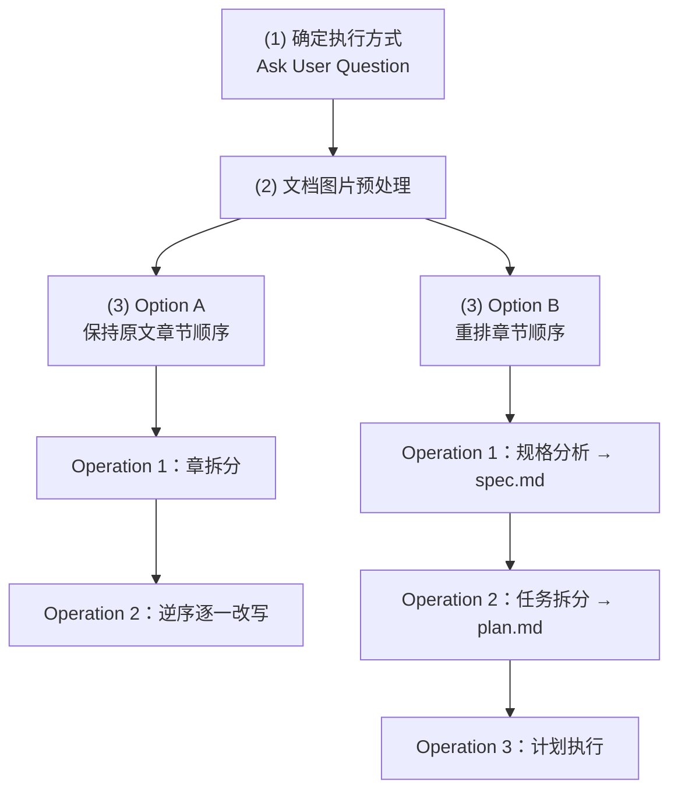

# Phase 3: Document Rewrite（文档改写）

## 概述

此 Phase 在**独立上下文的 Sub Agent** 中执行，包含三个子步骤：

1. **确定执行方式**：询问用户是否保持原文章节顺序
2. **文档图片预处理**：为每张图片添加 Markdown 注释
3. **文档重写**：根据用户选择进入 Option A 或 Option B



---

## (1) 确定执行方式

### 执行方式

通过 `AskUserQuestion` 询问用户：

**问题**：是否保持原文的章节顺序？

**备选答案**：
- "是" → 进入 **Option A**（保持原文章节顺序）
- "否" → 进入 **Option B**（重排章节顺序）

### 适用场景

| Option | 适用场景 | 特点 |
|--------|---------|------|
| Option A | 原文的章节组织合理，只需优化各章内容 | 保持原有结构，优化内容表达 |
| Option B | 原文的章节组织需要重组，涉及合并、拆分、重排 | 重新规划文档结构 |

---

## (2) 文档图片预处理

### 目标

在每张图片下方使用 Markdown 注释，记录图片路径、推测的图片用途和图片内容描述，为后续改写步骤提供辅助信息。

### Markdown 识别格式

文档中的图片可能采用以下格式：

1. **Wiki-link 格式**：`![[{图片文件路径}]]`
2. **标准 Markdown 格式**：``
3. **HTML 格式**：``

### 注释格式

```markdown
<!--
图片内容说明
路径：{图片文件路径}
用途：{推测出来的图片用途}
内容：{提炼出的图片内容说明}
-->
```

### 执行过程

#### Step 1：定位图片

启动一个拥有**独立上下文的 Sub Agent** 负责预处理任务调度：

- 找到并记录每张图片在文档中的位置
- 生成处理计划

#### Step 2：逆序添加注释

按照**从下到上逆序**方式，为每张图片创建一个独立 Sub Agent 执行以下操作：

1. **解析图片**：解析文档中的图片并参考临近文本，推测图片用途、提炼图片内容描述
2. **添加/修改注释**：在图片下方添加 Markdown 注释
   - 如果这张图片**已经有** Markdown 注释，则**修改**注释内容
   - 如果这张图片**没有** Markdown 注释，则**添加**注释

确保注释始终与图片一致。

### 设计动机：逆序执行

- 先处理后面的图片不会改变前面图片在文档中的位置
- 为接下来处理前面的图片提供便利

### 设计动机：每张图片独立 Sub Agent

- 各图片的说明任务相互独立
- 调度 Sub Agent 只负责调度，拆分执行可节省其上下文
- 确保文档图片较多时仍能正常处理

### 示例

**原文档**：
```markdown
## 1. 简介


本文介绍了系统架构。
```

**预处理后**：
```markdown
## 1. 简介


<!--
图片内容说明
路径：./images/architecture.png
用途：展示系统的整体架构设计
内容：图片包含三个主要模块：用户界面、业务逻辑层、数据存储层，各模块之间用箭头表示数据流向
-->

本文介绍了系统架构。
```

---

## (3) 文档重写

根据用户在"(1) 确定执行方式"中的回答，进入 Option A 或 Option B 分支。

---

### Option A：保持原文章节顺序

适用场景：原文的章节组织合理，只需优化各章内容。

#### Operation 1：章拆分

由一个**独立 Sub Agent** 完成，对 `{rewritten_file_path}` 进行章节划分。

##### 执行前思考

使用第一性原理思考：在不更改正文内容和顺序的前提下（仅通过添加/修改/删除章标题 `## {n}.` 来拆分），如何划分章节能帮助读者——

1. 确定文档的主题边界与覆盖范围
2. 建立主题之间的逻辑关系
3. 为不同读者提供最粗粒度的导航入口

##### 执行步骤

按思考结论制定计划并执行：
- 分析文档内容结构
- 确定章的划分点
- 添加或修改章标题（`## {n}. {章名称}`）

#### Operation 2：逆序逐一改写

由一个**调度 Sub Agent** 管理，按**从下到上逆序**为每章创建一个独立 Sub Agent 执行改写。

##### 设计动机：逆序执行

- 避免后续章节改写时上下文漂移导致前面的章节与已改写的后面章节风格不一致
- 先改后面的章节，前面章节的 Sub Agent 能参考已改写部分的风格参照

##### 各章 Sub Agent 执行步骤

负责各章的 Sub Agent 执行两步：

###### Step 1 — 产出规格

结合本章内容，在遵守 `{system_rules}` 的前提下：
1. 判断 `{initial_requirements}` 和 `{workspace_directory}/requirements.md` 中哪些需求与本章相关
2. 确定如何改写本章
3. 将规格保存至 `{workspace_directory}/spec_{chapter_number}.md`
   - `{chapter_number}` 为 Operation 1 章拆分后各章的序号，从 1 递增

**规格中须包含本章的写作结构方案**：
- 内容以何种逻辑顺序与层次关系组织
- 如：因果递进、问题驱动、概念分层、结论先行等
- 以最有效地向目标读者传达本章内容

可使用成熟的写作框架，也可自行设计结构，选择时须确保：
1. 适合单章改写的粒度
2. 符合 `{workspace_directory}/requirements.md` 中的需求设定
3. 与本章内容匹配

###### Step 2 — 执行改写

参考 `{workspace_directory}/spec_{chapter_number}.md` 完成本章改写。

**注意事项**：
- 文档中图片下方附有 Markdown 注释（由 (2) 文档图片预处理步骤添加），改写时可参考这些注释理解图片内容
- 若工作量较大，该 Sub Agent 可自行决定进一步拆分子任务到更多 Sub Agent 串行完成以节省上下文

---

### Option B：重排章节顺序

适用场景：原文的章节组织需要重组，可能涉及合并、拆分、重排章节。

以下三个操作在一个拥有**独立上下文的 Sub Agent** 中**串行**执行：

#### Operation 1：改写结果规格分析

启动**独立上下文的 Sub Agent** 完成：

##### 使用第一性原理思考

要达成 `{initial_requirements}` 和 `{workspace_directory}/requirements.md` 中的要求：
1. `{rewritten_file_path}` 应改写成什么样子？
2. 如何组织内容结构？
3. 如何满足目标读者的需求？

##### 审慎原则

- 不假设用户已完全清楚自己想要什么
- 若动机和目标不清晰，停下来与用户讨论
- 若目标清晰但路径非最优，告知用户并建议更好的方案

##### 产出规格文档

将分析结果保存为规格文档 `{workspace_directory}/spec.md`：
- 内容须足够清晰，使无相关上下文的 Sub Agent 也能独立使用
- 包含改写目标、内容结构、写作风格等

#### Operation 2：任务拆分与计划制定

启动**独立上下文的 Sub Agent** 完成：

##### 制定执行计划

以 `{workspace_directory}/spec.md` 为准：
1. 参考 `{initial_requirements}`
2. 参考 `{workspace_directory}/requirements.md`
3. 制定执行计划

##### 计划结构

执行计划应分为若干步骤，每步包含：
- 本步骤的规格说明
- 执行过程

**规格说明中须包含写作结构方案**：
- 该步骤所处理的文档内容以何种逻辑顺序与层次关系组织
- 如：因果递进、问题驱动、概念分层、结论先行等
- 以最有效地向目标读者传达

可使用成熟的写作框架，也可自行设计结构，选择时须确保：
1. 符合 `{workspace_directory}/requirements.md` 中的需求设定
2. 与该步骤负责改写的文档内容相匹配

##### 产出计划文档

执行计划保存至 `{workspace_directory}/plan.md`：
- 计划要足够清晰，使无相关上下文的 Sub Agent 也能独立使用

#### Operation 3：计划执行

启动**独立上下文的 Sub Agent** 完成：

##### 执行计划

参考：
- `{workspace_directory}/spec.md`
- `{initial_requirements}`
- `{workspace_directory}/requirements.md`

逐一执行 `{workspace_directory}/plan.md` 中的步骤。

##### 注意事项

- 文档中图片下方附有 Markdown 注释（由 (2) 文档图片预处理步骤添加），改写时可参考这些注释理解图片内容
- 每个步骤使用一个独立 Sub Agent 执行，以节省上下文

---

## 并发控制规则

Phase 3 中可能同时拆分出多个 Sub Agent。为避免触发大模型 API 并发度限制：

### 并发控制策略

**多个 Sub Agent 必须 2 个 2 个地分配运行**：
- 同时最多 2 个 Sub Agent 在执行
- 待其中一组完成后再启动下一组

### 示例

假设需要改写 6 章：

```
第 1 组：Chapter 6, Chapter 5
   ↓ (等待完成)
第 2 组：Chapter 4, Chapter 3
   ↓ (等待完成)
第 3 组：Chapter 2, Chapter 1
```

## 输出文件

Phase 3 完成后，改写文档位于：
`{rewritten_file_path}` = `{source_file_dir}/{source_file_name}_rewritten.md`

## 注意事项

1. **遵守系统规则**：整个改写过程必须遵守 `references/system-rules.md` 中定义的系统规则
2. **四级标题体系**：改写文档必须严格遵循四级标题体系（参考 `references/title-system.md`）
3. **源文件只读**：不得修改 `{source_file_path}`，所有改写操作在 `{rewritten_file_path}` 上进行
4. **参考需求文档**：改写时必须参考 `{workspace_directory}/requirements.md` 中的用户需求
5. **合理拆分**：根据文档规模和复杂度，合理拆分 Sub Agent 任务，避免上下文窗口耗尽
