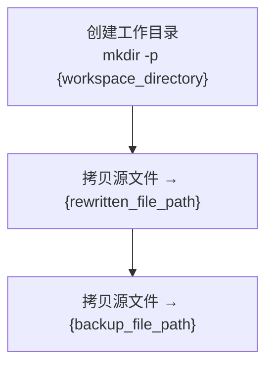
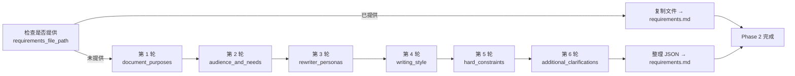
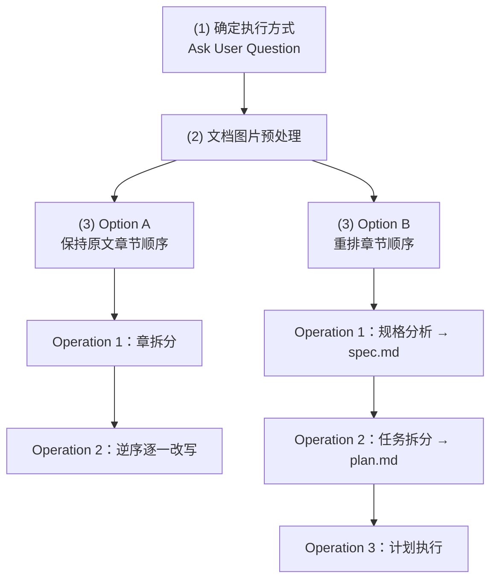
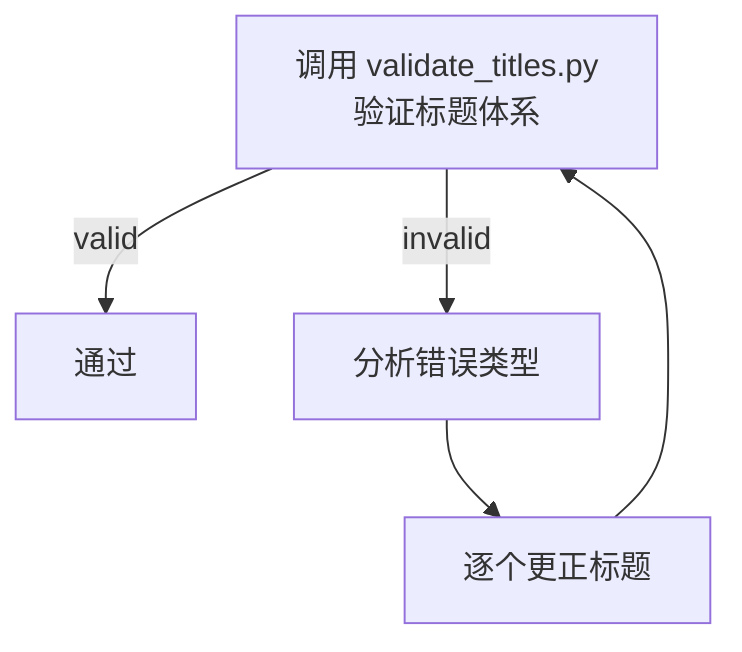

# Markdown 文档改写 Skill

本 Skill 通过四阶段流程将用户提供的 Markdown 文档改写为高质量版本：


**设计动机**：将改写拆分为"准备 → 澄清 → 执行 → 检查"四个独立阶段，使每个阶段职责边界清晰。各阶段在独立上下文的 Sub Agent 中运行，避免单次改写的上下文窗口耗尽。

## 输入参数

Skill 接收以下输入参数：

| 参数 | 类型 | 必填 | 默认值 | 说明 |
|------|------|------|--------|------|
| `source_file_path` | string | 是 | - | 源 Markdown 文件的路径，是改写内容的唯一来源 |
| `initial_requirements` | string | 否 | "" | 用户对改写结果的初始需求（自然语言描述，如重点方向、风格偏好） |
| `requirements_file_path` | string | 否 | "" | 现有需求文件的路径。若提供则跳过 Phase 2 的 6 轮澄清，直接复用 |

`source_file_path` 是改写内容的唯一真实来源（single source of truth）。Skill 在整个生命周期中**不会修改**它——所有改写操作都在源文件同目录下的副本（`{rewritten_file_path}`）上进行。

`initial_requirements` 用于引导 Phase 2 的需求澄清更聚焦；用户从零开始时可留空，Phase 2 会通过 6 轮交互逐步引导。

`requirements_file_path` 用于复用已有需求。如果用户之前已经做过类似改写、或已有需求模板，提供此参数可跳过 6 轮澄清直接进入 Phase 3。

## System Rules（最高优先级）

System Rules 定义了 Skill 执行过程中不可逾越的边界条件。它们拥有最高优先级——任何执行阶段的逻辑都不得覆盖或违反这些约束，且对主 Agent 和执行期间产生的所有 Sub Agent 均有效。

### 1. 源文件只读

严禁以任何方式修改 `{source_file_path}` 所指的源文件。禁止的操作包括但不限于：写入、追加、覆盖、删除内容。

**设计动机**：源文件是改写的唯一真实来源。改写过程会产生大量中间状态，若源文件被意外修改，将无法回溯原始内容，改写的可追溯性和可重复性都会被破坏。源文件在整个 Skill 生命周期中必须保持只读。

### 2. 四级标题体系

改写文件中所有章节标题必须严格遵循四级标题体系：

| Level | 名称 | Markdown 前缀 | 编号格式 | 示例 |
|-------|------|--------------|----------|------|
| 1 | 章 | `##` | `## {n}. ` | `## 1. 概述` |
| 2 | 节 | `###` | `### {n}.{m} ` | `### 1.1 背景` |
| 3 | 小节 | `####` | `#### ({k}) ` | `#### (1) 技术背景` |
| 4 | 段落条目 | `#####` | `##### {circled_n} ` | `##### ① 历史发展` |

不允许超出这四个层级，每个层级的标题编号必须按上述定义编写。

**设计动机**：统一的标题层级保证改写文档的结构一致性。Skill 的改写流程会将文档拆分到多个 Sub Agent 并行处理，只有严格的标题规范才能确保各章节独立改写后仍能无缝拼合，不会出现层级冲突或编号错乱。

完整规范、字段含义、示例文档详见 `references/title-system.md`。

### 3. 工作区目录

Skill 运行期间生成的文件分为两类：

1. **输出文件**：改写副本存放在源文件同目录下（`{source_file_dir}`），保留源文件中的相对路径（图片、文档引用等）始终有效；原始备份存放在工作区目录（`{workspace_directory}`）中。
2. **中间产物**：除上述输出文件外，其余所有运行期间生成的文件（如 requirements.md、spec.md、plan.md 等）必须且只能存放在 `{workspace_directory}` 目录下。

**路径推导规则**（所有路径由 `{source_file_path}` 推导）：

| 变量 | 推导方式 | 示例（source = `./tech_note/codex.md`） |
|------|----------|----------------------------------------|
| `{source_file_dir}` | 取 `{source_file_path}` 的父目录 | `./tech_note/` |
| `{source_file_name}` | 取文件名部分（不含扩展名） | `codex` |
| `{workspace_directory}` | `{source_file_dir}/workspace/{source_file_name}/` | `./tech_note/workspace/codex/` |
| `{rewritten_file_path}` | `{source_file_dir}/{source_file_name}_rewritten.md` | `./tech_note/codex_rewritten.md` |
| `{backup_file_path}` | `{workspace_directory}/{source_file_name}_backup.md` | `./tech_note/workspace/codex/codex_backup.md` |

**路径绝对化说明**：`scripts/setup_workspace.py` 返回的所有路径都会被解析为**绝对路径**（通过 `Path.resolve()`）。后续阶段直接使用这些返回值，**不要**再次拼接相对路径片段，否则会得到错误位置。

**设计动机**：改写副本放在源文件同目录下，确保文档中基于相对路径的图片和 Wiki-link 引用不会因目录变更而失效。备份存放在工作区目录，与中间产物一起管理，避免污染用户文件系统，且清理和归档简单——只需处理一个目录。

## 四阶段执行流程

### 运行机制

#### Sub Agent 拆分策略

Phase 2 和 Phase 3 均在**独立上下文的 Sub Agent** 中执行。原因：每个 Phase 都需要读取完整源文件并与用户多轮交互或执行大量改写操作，若全部在主 Agent 中运行，上下文窗口会迅速耗尽。拆分为独立 Sub Agent 后，每个 Agent 只需关注当前阶段的任务，上下文利用率最优。

#### 并发控制规则

Phase 3 中可能同时拆分出多个 Sub Agent。为避免触发大模型 API 并发度限制，多个 Sub Agent 必须 **2 个 2 个地分配运行**——即同时最多 2 个 Sub Agent 在执行，待其中一组完成后再启动下一组。

**具体落地方式**：调度 Sub Agent 在一轮内**通过 Agent 工具同时启动 2 个 Sub Agent**（在同一条消息中发出 2 个 Agent 工具调用），等待这两个都返回后，再启动下一组的 2 个。不要一次启动 3 个或更多，也不要串行一个一个启动——前者会触发并发限制，后者浪费时间。

### Phase 1: 准备工作环境

在**主 Agent** 中执行（任务简单，无需 Sub Agent）。



**执行方式**：调用 `scripts/setup_workspace.py`：

```bash
python scripts/setup_workspace.py <source_file_path>
```

该脚本会：验证源文件存在且可读 → 创建工作目录 → 创建改写副本和备份 → 返回所有路径变量（JSON 格式）。后续阶段从返回结果中读取路径。

### Phase 2: 需求澄清

此 Phase 在**独立上下文的 Sub Agent** 中执行，目标是通过 6 轮提问澄清需求并将结果持久化到 `{workspace_directory}/requirements.md`。



#### 前置检查

检查用户是否提供了 `{requirements_file_path}` 参数：

- **若已提供**：直接将该文件的内容复制到 `{workspace_directory}/requirements.md`，跳过 6 轮需求澄清，Phase 2 完成。
- **若未提供**：继续执行 6 轮需求澄清流程。

**设计动机**：支持用户复用已有的需求规格文件，避免重复澄清相同的需求维度。用户可能在之前的改写中已经明确了需求，或者有预定义的需求模板，直接复用可节省时间。

#### 6 轮需求澄清流程

每一轮都使用 **AskUserQuestion** 工具向用户提问，**强制设置 `multiSelect: true`** 允许用户多选。

| 轮次 | 澄清问题 | 对应变量 |
|------|----------|----------|
| 1 | 改写后的文档将用于哪些场景？ | `document_purposes` |
| 2 | 改写后的文档面向哪些读者？他们各自的核心诉求是什么？ | `audience_and_needs` |
| 3 | 改写时应扮演什么角色身份？该角色擅长什么？ | `rewriter_personas` |
| 4 | 改写后的文档应采用怎样的表达风格（行文风格、内容深度、表达调性等）？ | `writing_style` |
| 5 | 改写过程中有哪些不可违反的硬性规则？ | `hard_constraints` |
| 6 | 还有其他需要澄清的问题吗？ | `additional_clarifications` |

**备选答案生成策略（强制多选）**：每一轮提问时，Sub Agent 必须使用 AskUserQuestion 工具，**强制设置** `multiSelect: true`，允许用户选择多个备选答案。Sub Agent 基于对 `{initial_requirements}` 和源文件内容的理解，结合前几轮用户的回答，生成该轮可能性最高的若干备选答案，按可能性从高到低排列，与问题一起提供给用户。用户可多选、也可打字补充。

**结果持久化**：所有轮次完成后，将各轮的问题和用户回答整理为 JSON，保存至 `{workspace_directory}/requirements.md`。

JSON 格式如下：

```json
{
  "document_purposes": {
    "clarification_question": "改写后的文档将用于哪些场景？",
    "answers": ["程序员技术培训", "向技术经理介绍该技术"]
  },
  "audience_and_needs": { "clarification_question": "...", "answers": ["..."] },
  "rewriter_personas": { "clarification_question": "...", "answers": ["..."] },
  "writing_style": { "clarification_question": "...", "answers": ["..."] },
  "hard_constraints": { "clarification_question": "...", "answers": ["..."] },
  "additional_clarifications": { "clarification_question": "...", "answers": ["..."] }
}
```

#### Phase 2 Sub Agent 调度指南

主 Agent 通过 Agent 工具启动一个独立上下文的 Sub Agent 完成 Phase 2：

```
Sub Agent 指令：
1. 阅读 {source_file_path} 和 {initial_requirements}（如有）
2. 检查是否提供 {requirements_file_path}
3. 若已提供：复制该文件到 {workspace_directory}/requirements.md，Phase 2 完成
4. 若未提供：通过 6 轮 AskUserQuestion 澄清需求，每一轮都必须设置 multiSelect: true
5. 将结果保存为 JSON 格式到 {workspace_directory}/requirements.md
6. 报告完成
```

### Phase 3: 文档改写

此 Phase 在**独立上下文的 Sub Agent** 中执行，包含三个子步骤：(1) 确定执行方式、(2) 文档图片预处理、(3) 文档重写。Skill 可自行判断是否需要进一步拆分子任务到更多 Sub Agent 中，但须遵守"2 个 2 个地分配运行"的并发控制规则。



#### (1) 确定执行方式

确定是否保持原文的章节顺序，备选答案为"是"和"否"。这是一道**单选题**——通过 AskUserQuestion 询问用户时**设置 `multiSelect: false`**（与 Phase 2 的强制多选不同）。

- 选择"是"：进入 **Option A**（保持原文章节顺序）
- 选择"否"：进入 **Option B**（重排章节顺序）

如果 `{initial_requirements}` 已经给出了答案，直接使用，不再调用 AskUserQuestion；如果没给，通过 AskUserQuestion 询问用户。

#### (2) 文档图片预处理

在每张图片下方使用 Markdown 注释，记录图片路径、推测的图片用途和图片内容描述，为后续改写步骤提供辅助信息。

**执行过程**：

启动一个拥有独立上下文的 Sub Agent 负责预处理任务调度：

- **Step 1 — 定位图片**：找到并记录每张图片在文档中的位置，生成处理计划。
- **Step 2 — 逆序串行添加注释**：按照从下到上的**逆序串行**方式，为每张图片创建一个独立 Sub Agent 执行以下操作：
  1. 解析文档中的图片并参考临近文本，推测图片用途、提炼图片内容描述。
  2. 在图片下方添加 Markdown 注释，记录图片的路径、用途和内容描述。如果这张图片已经有 Markdown 注释，则修改注释内容，确保注释始终与图片一致。
  3. 调用大模型 API 理解图片内容时，如果大模型 API 返回错误，则降级到基于图片上下临近的文字来推测图片内容，不用勉强继续调用。

**设计动机**：

1. **逆序执行**——先处理后面的图片不会改变前面图片在文档中的位置，为接下来处理前面的图片提供便利。
2. **每张图片使用独立 Sub Agent**——各图片的说明任务相互独立，调度 Sub Agent 只负责调度，拆分执行可节省其上下文，确保文档图片较多时仍能正常处理。
3. **串行处理**——大模型对图片处理的 Rate Limiter 限制更严格，串行可以避免并发、避免触发限制。

**图片格式识别**：
- Wiki-link: `![[{图片文件路径}]]`
- 标准 Markdown: ``
- HTML: ``

**注释格式**：

```text
<!-- 
图片内容说明
路径：{图片文件路径}
用途：{推测出来的图片用途}
内容：{提炼出的图片内容说明}
-->
```

#### (3) 文档重写

根据用户在 (1) 中的回答，进入 Option A 或 Option B 分支。两个分支的详细操作说明（执行步骤、产出物、设计动机）请参考 `references/phase3-operations.md`。

**Option A：保持原文章节顺序** —— 适用场景：原文的章节组织合理，只需优化各章内容。包含两个 Operation：章拆分 → 逆序逐一改写。

**Option B：重排章节顺序** —— 适用场景：原文的章节组织需要重组（合并、拆分、重排）。包含三个 Operation：规格分析 → 任务拆分与计划制定 → 计划执行。

#### Phase 3 Sub Agent 调度指南

主 Agent 通过 Agent 工具启动一个独立上下文的 Sub Agent 完成 Phase 3：

```
Sub Agent 指令：
1. 阅读 {rewritten_file_path}、{workspace_directory}/requirements.md 和 {initial_requirements}
2. 通过 AskUserQuestion 确定执行方式（Option A 或 B），设置 multiSelect: false（单选）
   - 如果 {initial_requirements} 已明确，直接使用
3. 执行文档图片预处理（逆序串行，遵守并发控制规则）
4. 根据用户选择，进入 Option A 或 Option B（详见 references/phase3-operations.md）
5. 遵守并发控制规则：同时最多 2 个 Sub Agent 在执行
6. 完成后报告改写完成
```

### Phase 4: 质量检查

此 Phase 在**独立上下文的 Sub Agent** 中执行，目标是验证改写文件的质量，目前实现标题体系验证。



#### 步骤 1：验证标题体系

调用 `scripts/validate_titles.py` 验证改写文件是否符合四级标题体系规范：

```bash
python scripts/validate_titles.py {rewritten_file_path}
```

验证脚本检查以下问题：

**P0 检测（必须通过）**：
- **P0-1 格式问题**（error）：前缀、编号、空格、内容是否符合规范
- **P0-2 越级使用**（error）：标题是否跳跃层级（如 Level 1 → Level 3）
- **编号递增错误**（error/warning）：各级编号是否正确递增
- **超出四级**（error）：是否使用了 Level 5+
- **父子关系错误**（error）：Level 2 的父级编号是否匹配

**P1 检测（建议通过）**：
- **P1-3 编号顺序混乱**（warning）：编号出现顺序是否正确（如 `### 1.3` 在 `### 1.2` 之前）
- **P1-4 空标题**（warning）：标签后是否有内容

验证脚本返回 JSON 格式的结果（含 `valid`、`errors`、`warnings`、`title_count`、`summary` 字段）。

#### 步骤 2：更正（仅当验证失败时）

如果验证失败（`valid != true` 或存在 error 级别的错误），启动一个独立 Sub Agent 分析错误并逐个更正。

**更正策略**：

1. 解析验证脚本返回的 `errors` 和 `warnings` 列表
2. 按优先级处理错误：
   - **P0 级别（error）必须修复**：格式、越级、递增、超出四级、父子关系
   - **P1 级别（warning）建议修复**：顺序、空标题
3. 对于每个错误，识别错误类型并更正：
   - **格式错误**：修正编号格式（如 `### 1.1背景` → `### 1.1 背景`）
   - **越级使用**：插入缺失的中间层级标题
   - **编号递增错误**：重新编号标题
   - **超出四级**：降级到 Level 4 或调整结构
   - **空标题**：补充标题内容或删除空标题
   - **编号顺序混乱**：调整标题顺序
4. 修复后重新验证，直到 `valid == true` 或达到最大迭代次数（建议 5 次）

**设计动机**：自动更正减少用户手动操作，设置最大迭代次数防止无限循环。如果仍失败，报告错误并建议人工审查。

#### 并发控制

此 Phase 不涉及并发，只需单 Sub Agent 串行执行。

#### 关于 fix_titles.py 的能力边界

`scripts/fix_titles.py` 仅作为**辅助工具**，能自动修复一部分常见问题（如格式错误、编号递增错误）。但以下错误类型脚本无法自动修复，需要 Sub Agent 通过 Edit 工具手动处理：

- **越级使用（skip_level）**：需要根据上下文判断该插入什么内容的中间层级标题
- **超出四级（overflow）**：需要根据语义决定降级到 Level 4 还是重组结构
- **空标题（empty）**：需要根据上下文补充合适的内容

因此 Phase 4 的实际执行策略是：**Sub Agent 直接用 Edit 工具逐个更正错误**，validate_titles.py 用于检查、fix_titles.py 可选用于辅助。不要把 fix_titles.py 当作"一键修复"工具——它无法替代 Sub Agent 的判断。

#### Phase 4 Sub Agent 调度指南

```
Sub Agent 指令：
1. 调用 validate_titles.py 验证 {rewritten_file_path}
2. 如果 valid == true 且无 error 级别错误，报告质量检查通过
3. 如果验证失败：
   a. 分析 errors 和 warnings 列表
   b. 按优先级逐个更正（P0 > P1）
   c. 修复后重新验证
   d. 重复直到 valid == true 或达到最大迭代次数（建议 5 次）
4. 报告最终结果（通过/失败及错误详情）
```

## 总结：核心设计原则

1. **四阶段分离**：准备 → 澄清 → 执行 → 质量检查，职责边界清晰
2. **Sub Agent 拆分**：避免上下文窗口耗尽，每个 Agent 专注当前阶段
3. **System Rules 最高优先级**：源文件只读、四级标题体系、工作区隔离
4. **逆序执行策略**：在图片预处理和章节改写中使用逆序，避免位置漂移
5. **并发控制**：2 个 Sub Agent 一组执行，避免 API 并发限制
6. **质量保证**：Phase 4 自动验证标题体系，确保改写文档符合规范

## 参考文档

- `references/title-system.md`：四级标题体系完整规范、字段含义、示例文档
- `references/phase3-operations.md`：Phase 3 Option A 和 Option B 各 Operation 的详细执行说明
- `scripts/setup_workspace.py`：Phase 1 工作环境准备脚本
- `scripts/validate_titles.py`：Phase 4 标题体系验证脚本
- `scripts/fix_titles.py`：标题修复辅助脚本（Phase 4 更正时可选使用）
