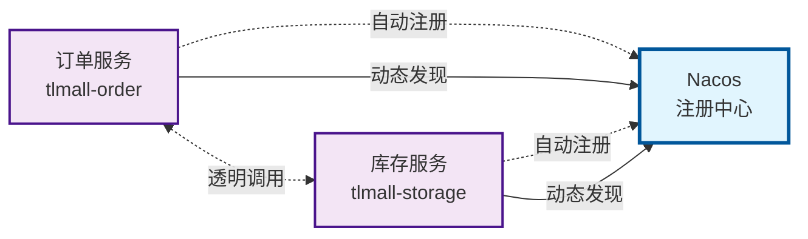

# /md-refine-expression

语言表达优化工具，专门用于提升markdown文档的准确度、清晰度和流畅度。

## Usage

```markdown
/md-refine-expression {input_file_path}
```

## Parameters

- `input_file_path`: 需要优化的markdown文件路径

## Output

优化后的完整markdown内容（UTF-8编码）直接输出到标准输出，不修改原文件。

## 核心特性

### 表达风格优化
- **准确度提升**：修正措辞不当、表达不准确的地方
- **清晰度增强**：优化句式结构，消除歧义和模糊表达
- **流畅度改善**：调整语言节奏，使阅读更加自然顺畅

### 内容保护机制
- **实质内容不变**：绝对不杜撰或丢失任何实质内容
- **技术元素保护**：代码块、图片、链接、HTML标签等元素保持不变
- **结构完整保留**：保持原文档的结构层次和逻辑关系

### 智能语言处理
- **上下文理解**：基于整篇文档的上下文进行优化
- **风格一致性**：确保整篇文档的表达风格协调统一
- **专业适配**：根据文档类型调整表达风格

## 核心约束

### 硬约束（不可违反）

| 约束类型 | 具体要求 | 违反后果 |
|----------|----------|----------|
| **代码保护** | 源代码块（```）100%保留 | 程序运行错误，技术信息丢失 |
| **媒体保护** | 所有图片链接和属性完整保留 | 视觉信息缺失，用户体验下降 |
| **链接保护** | 超链接和所有属性完整保留 | 导航功能失效，资源无法访问 |
| **HTML保护** | HTML标签和第三方组件完整保留 | 页面结构破坏，功能异常 |
| **实质内容保护** | 不杜撰或丢失实质内容 | 信息准确性受损 |

### 代码块格式要求
- **代码块前空行**：代码块前面必须有一行空行
- **无缩进标记**：``` 标记不得有任何缩进
- **格式规范**：
  ```markdown
  正确示例：
  这是一段文字说明。

  ```python
  def hello():
      print("Hello, World!")
  ```

  错误示例：
  这是一段文字说明。
  ```python
  def hello():
      print("Hello, World!")
  ```
  ```

## 优化范围

### 允许的调整

#### 1. 句式结构优化
- 主动/被动语态转换
- 长句/短句调整
- 主谓宾顺序调整
- 修饰语位置优化

#### 2. 措辞表达优化
- 同义词替换（更精准的表达）
- 搭配优化（更符合语言习惯）
- 语序调整（更符合逻辑关系）
- 语气调整（更符合场景需求）

#### 3. 连接词优化
- 添加逻辑连接词（因此、然而、总的来说）
- 调整连接词位置
- 优化过渡句表达

#### 4. 标点符号优化
- 修正使用不当的标点符号
- 调整标点符号位置
- 优化断句节奏

### 禁止的操作

#### 1. 实质内容变更
- ❌ 添加新的观点、论据、数据
- ❌ 删除原有的核心信息
- ❌ 改变原文的逻辑关系
- ❌ 补充背景信息或解释说明

#### 2. 结构层次调整
- ❌ 修改markdown标题层级
- ❌ 调整段落所属关系
- ❌ 改变内容组织结构

#### 3. 技术元素修改
- ❌ 修改代码内容
- ❌ 更改链接地址
- ❌ 调整HTML标签
- ❌ 删除或添加图片

## 执行流程

### 第一步：文档分析
1. **内容理解**：理解文档的主题、类型和目标读者
2. **风格识别**：识别原文的表达风格特点
3. **问题识别**：发现措辞不当、表达不清、语句不通顺的地方

### 第二步：表达优化
1. **句式调整**：优化句式结构，提升表达清晰度
2. **措辞优化**：选择更精准的词汇和表达
3. **流畅度改善**：调整语言节奏，使阅读更自然
4. **一致性检查**：确保整篇文档风格统一

### 第三步：质量验证
1. **实质内容对照**：确保没有杜撰或丢失实质内容
2. **技术元素检查**：验证代码、链接等元素完整保留
3. **格式规范检查**：检查代码块前空行和```标记无缩进
4. **表达效果评估**：评估优化后的清晰度和流畅度提升

### 第四步：结果输出
1. **UTF-8编码输出**：确保中文字符正确显示
2. **完整内容输出**：输出优化后的完整markdown内容
3. **标准输出流**：直接输出到标准输出，不写入文件

## AI 执行提示词

```text
你是语言表达专家。请优化提供给你的markdown文档的措辞表达，提升其准确度、清晰度、流畅度。

**核心要求：**

1. **仅从表达风格的角度进行优化**
   - 优化句式结构和措辞表达
   - 调整语言节奏和连接词
   - 修正标点符号使用
   - 提升表达的准确性和清晰度

2. **严格保护实质内容**
   - 不杜撰任何新的观点、数据、论据
   - 不删除原有的核心信息
   - 不改变原文的逻辑关系
   - 不补充背景信息或解释说明

3. **完整保留技术元素**
   - 代码块、图片、链接、HTML标签等元素保持不变
   - 代码块前面必须有一行空行
   - ```标记不得有任何缩进

4. **UTF-8编码输出**
   - 使用UTF-8编码输出完整的markdown内容
   - 确保中文字符正确显示

**处理原则：**

- **准确度优先**：优先修正表达不准确的地方
- **清晰度关键**：消除歧义和模糊表达
- **流畅度提升**：使阅读更加自然顺畅
- **风格一致性**：保持整篇文档风格统一
- **最小化改动**：在达到目标的前提下尽量少改动
```

## 使用示例

### 基础用法
```markdown
/md-refine-expression "document.md"
```

### 与其他命令配合
```markdown
# 完整的文档处理流程
/md-refine-titles "document.md" → "document_titled.md"
/md-pyramid-rewrite "document_titled.md" → "document_structured.md"
/md-refine-expression "document_structured.md" → "document_final.md"
```

## 优化效果示例

### 优化前（表达不够准确）
> 这个功能的实现方法是通过使用一种叫做缓存的技术来提高系统的性能，它能够减少数据库的访问次数，从而让系统运行得更快。

### 优化后（表达更加准确清晰）
> **该功能通过缓存技术显著提升系统性能。** 缓存机制有效减少数据库访问频率，从而大幅提高系统运行速度。

### 优化前（语句不够流畅）
> 在我们的系统中，有很多不同的模块，它们之间需要进行通信，为了实现这个功能，我们使用了一种消息队列的技术。

### 优化后（语句更加流畅）
> **系统采用消息队列技术实现模块间通信。** 这种方式确保了各个模块之间的高效数据交换。

## 质量控制清单

### 内容完整性检查
- [ ] 所有实质内容完整保留
- [ ] 没有添加新的观点、数据、论据
- [ ] 没有删除原有的核心信息
- [ ] 逻辑关系保持不变

### 技术元素检查
- [ ] 所有源代码块（```）完整保留
- [ ] 所有代码块前有一行空行
- [ ] 所有```标记无缩进
- [ ] 所有图片链接和属性完整保留
- [ ] 所有超链接和属性完整保留
- [ ] 所有HTML标签和第三方组件完整保留

### 表达效果检查
- [ ] 表达更加准确清晰
- [ ] 消除了歧义和模糊表达
- [ ] 语言流畅度得到提升
- [ ] 整篇文档风格保持一致

### 格式规范检查
- [ ] 使用UTF-8编码
- [ ] 输出到标准输出流
- [ ] markdown格式正确

## 常见问题

### Q: 这个命令与 md-pyramid-rewrite 有什么区别？
**A**: md-pyramid-rewrite 主要进行结构重组和表达方式转换（如文字转表格），而 md-refine-expression 专注于语言表达的优化（措辞、句式、流畅度），不改变文档结构和表达方式。

### Q: 会修改文档的结构吗？
**A**: 不会。md-refine-expression 只优化语言表达，完全保持文档的标题层级、段落结构等不变。

### Q: 代码内容会被优化吗？
**A**: 不会。所有代码块100%完整保留，包括代码块前空行和```标记的格式要求。

### Q: 如何确保没有改变实质内容？
**A**: 通过严格的约束机制和对照检查，确保每个信息点都能在原文中找到依据。

## 预期效果

通过此命令，可以在保持实质内容和技术元素完整的前提下，显著提升文档的表达质量，使文档更加准确、清晰、流畅，提升读者的阅读体验。

## 参考输出样本的表达风格

```text

## 2. Nacos 服务注册与发现

**微服务架构**中，服务间调用地址和端口的配置方式，直接影响系统的**可维护性**和**可扩展性**。本节阐述 **Nacos 注册与发现机制**如何解决 **硬编码方式**带来的核心挑战。

### 2.1 硬编码方式的痛点

采用**硬编码方式**配置服务调用时，会面临以下挑战：

| 挑战维度 | 具体问题 | 核心影响 |
| --- | --- | --- |
| **维护成本高** | 服务地址变更时，需同步修改所有调用方配置 | 配置分散，易出错，回归成本高 |
| **扩展性差** | 新增服务实例或调整端口时，影响面广 | 无法快速水平扩展，响应业务变化慢 |
| **负载均衡困难** | 无法灵活实现服务的水平扩展和负载分配 | 流量分配不均，资源利用率低 |
| **运维复杂** | 生产环境中服务部署和迁移变得困难重重 | 运维效率低，故障恢复慢 |

### 2.2 服务注册与发现机制

引入**服务注册与发现机制**，通过**动态注册中心**解决上述问题。

**核心思路：**

> 服务启动时**自动注册**到注册中心，调用方通过**服务名**动态发现目标实例，实现**调用与地址解耦**。

**架构原理：**



**机制价值：**

| 价值维度 | 说明 |
| --- | --- |
| **调用解耦** | 服务调用使用**服务名**而非具体地址，下游部署变更不影响上游 |
| **动态感知** | 实时感知服务实例的**上线、下线、健康状态**，自动调整调用策略 |
| **负载均衡** | 配合负载均衡器，实现请求在多个实例间的**智能分配** |
| **运维简化** | 服务部署、扩容、迁移无需修改配置，降低运维复杂度 |
```